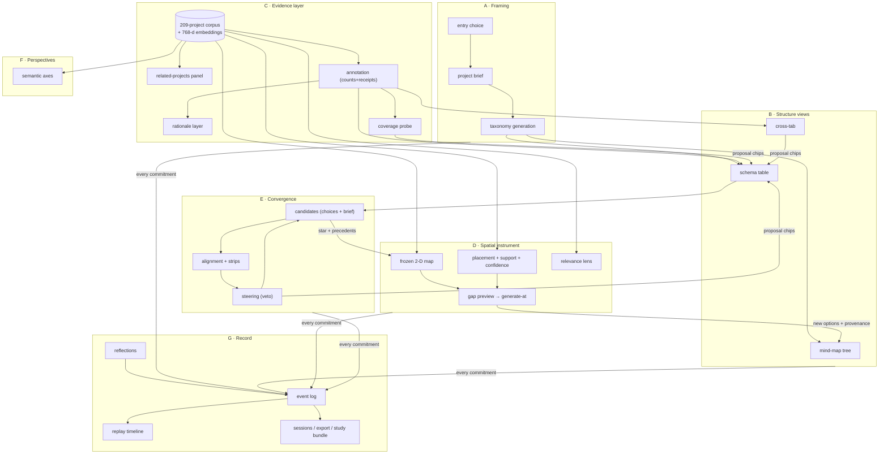
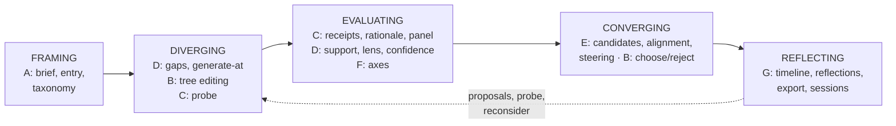
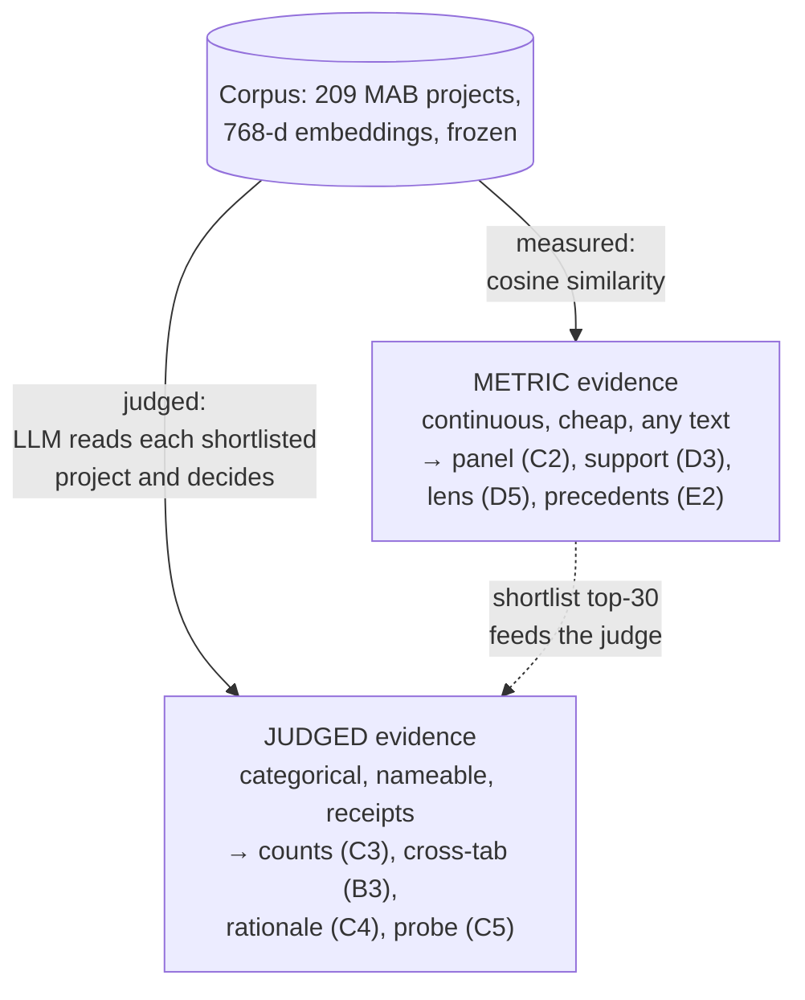
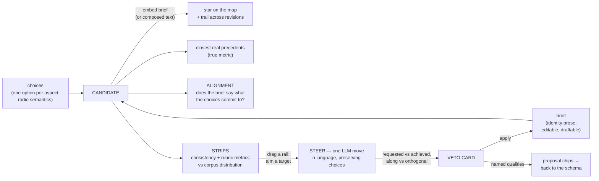
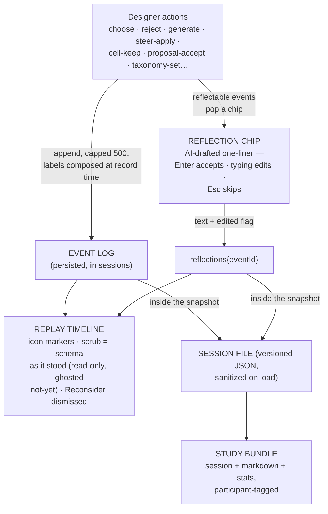

# FEATURE-ATLAS.md — every implemented feature: purpose, mechanism, checks, critique

*Created 2026-07-03 (post-Wave-1 state). **Live** document.*

**What this is.** A writing companion and decision aid: the complete inventory of
what is actually built, feature by feature, with (a) the purpose — which moment of
the design process it serves, (b) the mechanism and its interconnections, (c) a
concrete way to *check* it yourself, (d) the honest delta between what was intended
and what is implemented, and (e) critique — including **questions addressed to you**,
because the point of this document is to sharpen your own writing and your next
decisions, not to pre-write them.

**What this is not.** Not the research argument (that is
[PROJECT-REPORT.md](PROJECT-REPORT.md) — read its §1.3 for *why the additions fit
together* and §5 for the iteration history), not an API reference
([BACKEND.md](llmind-python/BACKEND.md)), not a UI map
([FRONTEND.md](llmind-web/FRONTEND.md)). When this document and those disagree,
those win — this one trades some precision for judgment.

**Reading keys used throughout:**

- **Stage** — where the feature sits in the design process, in the dissertation's
  vocabulary: `FRAMING` (constructing the space), `INFORMING` (expanding it),
  `FILTERING` (focusing/evaluating within it), `CONVERGING` (composing and
  committing), `REFLECTING` (revisiting the process), `META` (research validity —
  not designer-facing).
- **Origin** — `inherited` (the dissertation's prototype had it; re-implemented
  here), `debt` (built to answer a documented finding from the dissertation's
  study), `bet` (a post-dissertation addition justified by literature + internal
  measurement, not yet by users).
- **Check** — a concrete recipe: a UI path (assume backend on :8000, frontend on
  :3000/mindmap, LM Studio serving both models), a CLI command, or a file to open.
- **Δ Intended vs implemented** — what the source of intent said (dissertation,
  ITERATION-PLAN part, or plan doc) vs what the code does today.
- **❓** — a question for you. They are collected and grouped in §10.

---

## 0. The system at one glance

### 0.1 How the clusters feed each other

Eight clusters. Arrows are *data or state dependencies* — what a feature consumes
from another. Two shared substrates make almost every arrow possible: the **768-d
meaning space** (every text embedded by the same local model) and the **one store**
(a single persisted exploration state that all views read).

### 0.2 The design-process map

Where each cluster sits on the divergence–convergence arc (the dissertation's
informing/filtering runs across the whole arc — informing expands at any point,
filtering focuses at any point; they are operations, not phases):

❓ **Q0.** This atlas tags each feature with ONE primary stage, but several
genuinely serve two (the cross-tab both *evaluates* combinations and *generates*
into them). When you write, will you organize by process stage (clean narrative,
some violence to the features) or by cluster (true to the build, harder story)?
The tension is real — decide it once, early.

---

## Cluster A — Framing: from a designer's head to a manipulable structure

*The entry moment: turning a blank page (or a vague intention) into a constraint
structure that everything else operates on. Stage: `FRAMING`.*

### A1. Taxonomy generation (brief → aspects × options)

- **Stage/Origin:** FRAMING · `inherited` (mechanism changed — see Δ).
- **Purpose:** the dissertation's "conceptual primer" — convert a written project
  overview into a structured design space (aspects = dimensions of constraint,
  options = positions on them) within seconds, surfacing considerations the
  designer's initial mental model omits (P1's environmental-data moment).
- **Mechanism:** `POST /api/taxonomy/generate` — ONE structured LLM call
  (OpenAI or local, per dialog dropdown), prompted with a **fixed exemplar set**
  of 50 corpus projects pre-selected for diversity (farthest-point sampling), with
  schema-enforced JSON output. Also returns `corpus_similarity` (cosine of the
  brief to the corpus centroid, always computed locally); the UI shows a
  domain-mismatch notice below ~0.3.
- **Connects to:** replaces the whole working tree and **wipes all exploration
  state** (coords, candidates, discovered, provenance) — a new taxonomy is a new
  space; the event log survives with a `taxonomy_set` marker.
- **Check:** navigator → "Generate Taxonomy" (or "Edit Brief & Taxonomy" once one
  exists) → write an overview → generate. Verify the domain notice by submitting
  an off-domain brief (e.g. a cooking app). Offline: `uv run generate_taxonomy.py
  openai --dev --source selected -i data/50_selected_updated.json` prints the
  prompt without calling the LLM.
- **Δ Intended vs implemented:** the dissertation describes **Self-Refine**
  (iterative self-review) and implies per-query corpus retrieval. Implemented:
  the reflection loop is **commented out** (`generate_taxonomy.py:225–242`; the
  `num_reflections` API field only alters prompt wording), and grounding is the
  fixed exemplar set, not retrieval. Found and corrected in the report during the
  2026-07-03 audit (§5.7 №1); the re-enable/remove decision is ITERATION-M M-E10.
- **Works well:** structured-output enforcement is solid on both backends (the
  vLLM path manually strictifies the JSON schema); the corpus-similarity notice is
  a cheap, honest domain guard.
- **Critique:** the one-shot mechanism means taxonomy *quality* rests entirely on
  one prompt + exemplar set; there is no measured evidence that this is worse (or
  better!) than Self-Refine — only an unexamined divergence between claim and code
  that survived for weeks. Also: the 50-exemplar set is frozen — a brief about,
  say, sound-first installations gets the same exemplars as one about facades.
- ❓ **QA1.** Before deciding M-E10: what, concretely, do you believe reflection
  *adds* — coverage? coherence? de-duplication? Pick the one you'd bet on, because
  that determines what M-R9a should measure. If you can't name one, that is
  itself the answer (remove the parameter).
- ❓ **QA2.** Would per-brief exemplar retrieval (nearest-50 to the brief, instead
  of fixed farthest-50) make the primer more relevant, or would it *narrow* the
  taxonomy toward what the brief already knows — exactly the fixation the fixed
  diverse set was protecting against? This is a genuine design fork; note it in
  your writing as a deliberate choice, not an accident.

### A2. The default taxonomy + discover-first entry

- **Stage/Origin:** FRAMING · `bet` (the *prebuilt* space as a valid starting point).
- **Purpose:** let a designer explore the territory before committing to a brief —
  the other half of the layered model P1 asked for.
- **Mechanism:** `public/schema_selected.json` — **6 aspects** (Display Technology,
  Urban Context, Interaction Model, Content Theme, Temporal Strategy, Data &
  Content Governance), loaded via `schema-mindmap-data.ts` when no generated
  taxonomy exists.
- **Check:** clear localStorage (`mindmap-store`) → reload → the 6-aspect tree
  appears; first-run dialog offers the choice.
- **Δ:** "Spatial-Perceptual Integration" (the coverage probe's first live
  proposal) lives ONLY in sessions that accepted it — the shipped default is
  still 6 aspects. The report's earlier phrasing implied otherwise; corrected.
- ❓ **QA3.** The default taxonomy is itself an authored artifact (generated
  when? from what prompt? — its provenance is *not* recorded anywhere). If a study
  participant explores the default space, the study is partly evaluating this
  frozen artifact. Should its generation provenance be reconstructed and
  documented before the pilot?

### A3. First-run entry choice + the persistent project brief

- **Stage/Origin:** FRAMING · `debt` (P1: "a tool where you can write down what
  you're imagining… and then it gives you ideas depending on that").
- **Purpose:** two honest front doors — **brief-first** (inform → filter) vs
  **discover-first** (explore → inform later) — without forcing either.
- **Mechanism:** a once-only dialog on first structure-mode entry; brief-first
  opens the taxonomy dialog (its overview field IS the brief); the brief persists
  in the store (`projectBrief`), prefills "Edit Brief & Taxonomy", and — less
  visibly — **conditions gap generation** (D7 passes it as prompt context, logged
  as `brief_context`).
- **Check:** clear localStorage → reload → dialog appears once; choose brief-first,
  generate, then confirm the navigator button reads "Edit Brief & Taxonomy" and
  reopens prefilled. Tracked as `first_run_brief` / `first_run_discover` in usage.
- **Δ:** faithful to the intent; note the brief's *third* role (generation
  conditioning) was a separate hypothesis (Part 10's "squiggle") that hitchhikes
  on the same field — the designer is never told their brief steers gap-filling.
- ❓ **QA4.** Is the silent brief→generation conditioning a transparency gap by
  your own standards (the gap *preview* shows seeds but not the brief's
  influence)? The system's rule is "the designer sees the evidence a generation
  is conditioned on" — the brief is conditioning they *wrote* but may not know is
  active. Cheap fix: name it in the preview. Worth it?

---

## Cluster B — Structure views: one schema, three renderings

*The canonical model since Iteration K is the living design-space schema; the
tree, table, and cross-tab are lenses on it. Stage: `FILTERING` (with in-view
informing affordances). One selection is shared by every view.*

### B1. The mind-map tree

- **Stage/Origin:** FILTERING made physical · `inherited` (re-implemented with
  mind-elixir instead of the dissertation's JsMind).
- **Purpose:** local structure manipulation — add, rename, delete, drag, collapse;
  the dissertation validated the metaphor as self-explanatory to a novice.
- **Mechanism:** `simple-mindmap.tsx` wraps mind-elixir: init-once + `refresh` on
  external change (echo-guarded), edits stream back via the `operation` bus event,
  selection syncs both ways (by node id first — Wave 1 M-E5 — label fallback).
  Rejected options render muted; chosen ones bold. Zoom/pan grammar is shared
  with the map (same factors/limits).
- **Check:** Structure → Tree. Rename a node → its design-space coordinate is
  dropped (re-located on next map visit); create two same-label options under two
  aspects → selecting the second in the schema highlights the *second* in the
  tree (the M-E5 fix).
- **Δ:** the dissertation flagged the mind map's weak *overview* — that debt was
  paid by B2, not by improving the tree. Layout confusion P1 reported
  (asymmetric expansion) is inherent to the radial metaphor and not addressed.
- **Critique:** the tree is now the *least* load-bearing view (the schema is
  canonical, the map is evidential) yet remains the first thing a designer sees
  in Structure mode. Its unique value is direct manipulation ergonomics.
- ❓ **QB1.** Does the tree still earn its default position, or should Schema be
  the Structure mode's first tab for the study (it IS the canonical
  representation, and P1's stated preference)? This is a one-line change with
  real narrative consequences — the study would then test your architecture as
  you describe it.

### B2. The schema table (the living design-space schema)

- **Stage/Origin:** FILTERING/overview · `debt` (P1's literal request) +
  Halskov & Lundqvist's instrument, made live.
- **Purpose:** the whole space in one glance — every aspect × option with
  descriptions, evidence counts, and per-activity dynamics; the overview the
  mind map structurally cannot give.
- **Mechanism:** pan-zoomable card table (`schema-table.tsx`); cell grammar:
  violet ring = chosen (active candidate), struck = rejected, italic = informed
  (added during exploration); count badges from C3 (click → receipts popover →
  click a project → opens in the Related Projects panel); ± facet chips fade
  non-matching corpus glyphs on the map; in-table choose/reject/reopen and
  add-option; per-aspect rationale lines (C4) under headers; the coverage-probe
  chip (C5) in the status strip. Pure view logic in `schema-utils.ts` (tested).
- **Check:** Structure → Schema. Hover a count badge (the tooltip now states
  the shortlist-saturation semantics — Wave 1 F4); click it; click through a
  receipt. Toggle a facet and switch to Design Space — non-matching diamonds
  fade.
- **Δ:** intended (Part 12 A1) and implemented match closely. One semantic
  change landed in Wave 1: **too-broad = shortlist saturation** (≥24 of the 30
  nearest), not share-of-corpus — because counts are censored at the 30-project
  shortlist, the original Halskov-style threshold was mathematically unreachable
  (dead code from birth; §5.7 D1).
- **Works well:** the receipts pattern — *counts as evidence, never verdicts* —
  is the system's clearest embodiment of its own trust philosophy.
- **Critique:** a count reads as an absolute ("9 projects exemplify this") but is
  a *shortlist-censored lower-bound estimate* ("of its 30 most-similar projects,
  9 were judged to exemplify it"). The badge tooltip now says so; the bare number
  still doesn't.
- ❓ **QB2.** When you write about the schema for an ID audience, will you report
  counts as "N projects" or "N of the 30 nearest"? The former is cleaner and
  arguably misleading; the latter is honest and clunky. Whatever you choose in
  prose should match what the UI shows a participant — right now the UI shows
  the bare number with an honest tooltip. Is that enough?

### B3. The cross-tab (morphological lens)

- **Stage/Origin:** FILTERING → INFORMING pivot · `bet` (Halskov's hand-made
  cross-tab subspaces, automated; Zwicky's combinatorics with receipts).
- **Purpose:** turn "unexplored" from a diffuse spatial impression into an
  **exact, nameable claim**: this cell = projects committing to BOTH options;
  an empty cell = "no precedent combines X with Y".
- **Mechanism:** pick two aspects → option×option grid computed from the
  annotation (`buildCrossTabCells`); cells list exemplifying projects
  (receipts) and candidates committing to both; empty cell → "Generate into
  this gap" (seeded with half-matching exemplars, one concept, `cell-v1`
  logged) → veto preview → "Keep as candidate" creates a candidate skeleton;
  "show as continuous scatter" deep-links to F1.
- **Check:** Structure → Cross-tab → pick e.g. Urban Context × Interaction
  Model → find an empty cell → generate into it (needs LLM up) → keep →
  Candidate panel opens with the two choices set.
- **Δ:** matches Part 12 B2 intent. Note the dependency: cell contents are only
  as good as C3's counts — a D2-era undercount could have shown a *false* empty
  cell (a "gap" that isn't). Until the v5 re-annotation runs, treat empty cells
  as provisional.
- ❓ **QB3.** A false-empty cell is the worst failure this feature can have — it
  invites a designer to "fill" occupied territory. After the re-annotation,
  should the pilot include one deliberate spot-check (pick 2–3 empty cells,
  manually verify no corpus project combines those options)? That is a
  meaning-level gate (§5.4 discipline) this feature has never had.

---

## Cluster C — The evidence layer: real projects behind every abstraction

*The system's epistemic foundation: nothing is left as a plausible-sounding LLM
phrase if it can be anchored to nameable, inspectable precedent. Stage: serves
`FILTERING`/evaluation everywhere; the probe is `INFORMING`.*

Two *kinds* of evidence coexist here — keep them straight (they can disagree,
informatively):

### C1. The corpus + embedding substrate

- **Stage/Origin:** META-foundation · `bet`.
- **Purpose:** the shared ground truth — 209 real Media Architecture Biennale
  projects (210 scraped, 1 dropped for empty text), embedded at 768-d by the
  local `nomic-embed-text-v1.5`, frozen in `data/local_index.npz` (+ metadata
  sidecar).
- **Check:** `uv run python -c "import numpy as np; d=np.load('data/local_index.npz'); print(d['vectors'].shape)"`
  → `(209, 768)`. `annotation-stats` and `project-diagnose` read derived
  artifacts.
- **Critique:** single domain, single curator (MAB nominees), n=209. Every
  claim downstream inherits this ceiling — support percentiles, gaps, counts
  are all *relative to what MAB curators selected*, which skews toward
  award-worthy, documented, English-described projects.
- ❓ **QC1.** What is your generality claim going to be? "The *mechanism*
  generalizes; the *instance* is media architecture" is defensible — but only
  if you can say what a second domain would need (a scrapeable corpus of
  ~200+ described projects). Worth one paragraph of your writing now, before a
  reviewer asks.

### C2. Related Projects panel

- **Stage/Origin:** FILTERING/grounding · `inherited`.
- **Purpose:** the selected node's abstract phrase, made concrete: "here are
  real projects like this" (name, description, image).
- **Mechanism:** composite query `lineage | description | topic` embedded
  **raw** (no register correction) → brute-force cosine over the local index
  (`VECTOR_STORE=local`) → top-5. Placeholder row filtered everywhere (Wave 1
  M-E6); a corpus glyph clicked on the map pins that project at top, released
  on next node selection (the §5.5 sticky-pin fix).
- **Check:** select any node → panel populates; select a node with no close
  matches → "No closely related corpus projects" empty state and badge absent.
- **Δ — the standing honest exception:** intended (Part 11) "one evidence
  source"; implemented: the panel's query text and correction policy differ
  from placement's (§5.5, re-verified in the audit). The five projects shown
  are NOT guaranteed to be the five that placed the dot. Repair = M-E11,
  deliberately post-pilot.
- ❓ **QC2.** For the pilot: if a participant notices the panel and the dot's
  neighbourhood disagreeing, that is the §5.5 contradiction resurfacing as a
  trust event. Do you brief the facilitator to note it (free data on evidence
  scrutiny), or fix M-E11 first and lose that probe? You currently get to
  choose; after M-E11 you don't.

### C3. Corpus annotation (counts with receipts)

- **Stage/Origin:** FILTERING/evaluation · `debt`+`bet` (Halskov's hand
  annotation, automated).
- **Purpose:** the corpus⇄taxonomy bridge: per option, *which* real projects
  genuinely exemplify it — evidence a designer can name, not a score.
- **Mechanism:** per option: register-corrected embedding → top-30 shortlist by
  true cosine → local LLM judges membership in chunks of 5 (window-aware token
  budgets, reasoning-tail salvage — the thinking-model recipe, PROCESS §2) →
  `{count, project_ids, receipts}` + diagnostics (saturated ≥24/30;
  unprecedented ≤1). Cached per option content hash, salted by
  `ANNOTATION_VERSION` (**now 5**; the on-disk cache is still v4 — re-run
  pending). Async job, deduplicated across concurrent clients.
- **Check:** Structure → Schema (annotation runs automatically; cold ≈6–10
  min/option, cached = seconds). Offline:
  `uv run python database_pipeline.py annotation-stats` → current cache prints
  ~0.262 mean shortlist acceptance, 3 saturated, 10 unprecedented, and a
  version warning until re-annotated.
- **Δ:** two Wave-1 corrections: quoted-number membership arrays were silently
  dropped (undercounts, cached — D2), and the too-broad diagnostic was
  unreachable (D1). Both fixed; the *displayed counts predate the fixes* until
  re-annotation. Also intended-vs-implemented at the concept level: "Halskov
  annotated every project against every option"; this implementation judges
  only the 30 nearest per option — a cost-driven censoring that changes what
  "count" means (lower bound, saturation possible).
- **Works well:** the meaning-level gate discipline ("LED wall panels must
  list the known LED facades") caught three broken prompt architectures that
  green tests passed — the project's best single piece of method.
- ❓ **QC3.** The judge is the same model family that generates ideas. A
  systematic judge-validation (e.g. you hand-label 3 options × 30 shortlist
  items, compute agreement) has never been done — the LED gate checks one
  option's face validity. Before writing "automated Halskov annotation" in a
  paper: is a ~90-minute hand-labeling session worth the claim it would buy?

### C4. The rationale layer

- **Stage/Origin:** FILTERING/trust · `debt` (P1: "why these seven though?").
- **Purpose:** one line per aspect answering "why is this a dimension of this
  design space?", grounded in the annotation counts, labeled *AI, from corpus
  evidence* — the explanation shown where the question arises.
- **Mechanism:** `POST /api/corpus/rationale` (keyed async job) — per-aspect
  one-liners from the counts; cached per aspect+evidence
  (`data/projection/rationales/`); per-aspect LLM failure degrades to empty
  (explanation, never a gate). Annotation-gated on the frontend (10-min
  timeout).
- **Check:** Structure → Schema after annotation completes → "why:" lines under
  column headers; select an aspect → violet callout in the Context panel.
- **Δ:** matches L-A intent. The open question was never mechanism but
  *epistemics*: §5.6 weakness 1 (post-hoc self-justification can read grounded
  without being calibrated) stands in full.
- ❓ **QC4.** The planted-dimension probe (USER-TESTING-PLAN §9.1) is the only
  designed test of the rationale's failure mode, and it needs an ethics
  decision. If you *don't* adopt it, what evidence would let you write
  anything stronger than "participants reported trusting the rationale"? Name
  it now or accept the weaker claim.

### C5. The coverage probe

- **Stage/Origin:** INFORMING at the *structure* level · `debt` (P1: "is there
  no more?").
- **Purpose:** the inverse question — which real projects does the taxonomy
  *fail* to describe, and what dimension do they exemplify? Structure growth
  with evidence attached.
- **Mechanism:** frontend computes poorly-covered projects (pure set arithmetic
  over annotation results) → chip "N projects fit poorly" → on demand,
  `POST /api/corpus/missing-aspect` proposes ≤2 new dimensions (deduped against
  existing names) → amber proposal chips → accepting inserts a new aspect
  column with provenance `coverage`.
- **Check:** Schema view, after annotation → the strip chip; click → proposals
  arrive as chips; accept one → new column, marked informed.
- **Δ:** matches intent; first live run proposed "Spatial-Perceptual
  Integration" (plausible embodiment blind spot). Session-level only — by
  design.
- **Critique:** fixation risk moved *up* a level (accepting a dimension
  reshapes everything downstream); mitigation is the same chips-and-reconsider
  as everywhere, but structure-level anchoring is plausibly stronger and
  unmeasured (M-R3 reads it from the event log).
- ❓ **QC5.** The probe proposes dimensions from *outliers* — the projects the
  taxonomy describes worst. That biases proposals toward the corpus's fringe
  (which may be exactly right for divergence, or may surface curatorial noise).
  When you write this up: is "outlier-driven informing" a feature you defend
  on fixation-counteracting grounds, or a sampling artifact you flag? Pick a
  side; the text currently implies the former without arguing it.

---

## Cluster D — The spatial instrument: the map, its honesty, and aimed generation

*The empirical rendering of the design space: 209 real projects in a stable 2-D
frame, the designer's evolving material placed among them. Stage: spans
`INFORMING` (generate-at) and `FILTERING` (all the reading instruments).*

**The one rule (PROJECT-REPORT §1.3.2), restated because every feature below
instantiates it:** the 2-D layout *invites*; every measurement a designer might
act on is computed in the 768-d metric. The map is a stage, not a ruler.

### D1. The frozen surface

- **Stage/Origin:** the stage itself · `bet`.
- **Mechanism:** PCA(→64) → UMAP (n=15, min_dist 0.1, seed 42) fit ONCE on the
  corpus; trustworthiness **0.760** at k=15 (in the legend); 48×48 clickable
  lattice; density shading; corpus projects as diamonds (luminance hierarchy:
  pale field, vivid = related-to-selection). Never refit at runtime — which is
  what makes positions stable across sessions and the exploration cumulative.
- **Check:** Design Space view; legend shows reliability; `uv run python
  database_pipeline.py project-diagnose --offline` prints the artifact health.
- **Δ:** intended as *the* representation (DESIGN-SPACE-VIZ era); demoted by
  Iteration K to the *evidence lens* on the schema. The 48×48 lattice is a
  standing open question (§6 item 6): presentation convenience that accreted
  features (cell snapping, discovered cells, collision badges).
- ❓ **QD1.** The lattice question is queued for observation (M-R5). But there
  is a writing-question too: in your account, is the map a *visualization*
  (something to read) or an *instrument* (something to operate)? The lattice
  only makes sense under the instrument framing. Your §3 argument says
  instrument — make sure the prose never slips into gallery language.

### D2. Evidence-anchored placement

- **Stage/Origin:** FILTERING/reading · `bet`, re-litigated (Part 11).
- **Purpose:** put every node/idea/candidate *where its evidence is*: at the
  similarity-weighted centre of its top-5 corpus precedents' frozen positions.
- **Mechanism:** `/locate`: embed "topic. desc" → register correction (the
  fitted short→long map; cv 0.928 vs 0.905 baseline) → top-5 by true cosine →
  convex combination of their 2-D coords. Same anchors drive support (D3).
  Coords persist but **every node re-locates once per session** (stale-
  calibration refresh); renames drop coords immediately. Off-map placement is
  geometrically impossible (convex combination).
- **Check:** select a node in the map → its dot sits amid highlighted related
  diamonds; `project-align` re-prints the 3-way transform/kNN comparison
  (kNN median displacement 0.147–0.149 vs 0.179 across the two recorded runs).
- **Δ:** intended originally as UMAP's own `.transform()`; replaced after
  measurement showed ~⅓ false "beyond corpus range" flags. The chosen failure
  mode is now **false familiarity** (novel ideas pulled into the footprint,
  only the pale fill says so — §5.4 w1); "void placements" (anchors straddling
  clusters → dot lands between, LED's own confidence is 0.11) survive, flagged
  but positioned.
- ❓ **QD2.** You own the false-familiarity trade knowingly. If M-R4 shows the
  fill is unread, the *principled* responses differ in kind: (a) make the cue
  louder (design fix), (b) suppress low-support dots entirely (interaction
  fix), (c) concede placement should show uncertainty as *area not point*
  (representation fix — dots become blobs). Which is compatible with your §3
  argument? Decide the fallback before the study makes you improvise one.

### D3. Corpus support

- **Purpose:** "how much real precedent evidence exists for this idea at all?"
  — as a percentile against what real projects score *when described at node
  length* (the short-register baseline, Part 10's recalibration).
- **Mechanism:** mean top-5 cosine → percentile of the baseline persisted in
  `register_map.npz`; rendered as fill strength; washed-out = thin evidence
  (possibly novel, possibly vague — the receipts tell which).
- **Check:** default taxonomy spans ~0–66% (mean ~18%); "LED wall panels"
  style probes score high; an off-domain text scores near 0.
- **Δ:** first implementation compared node-length texts to full-description
  self-support — every node flattened to ~0 (the metric measured text length,
  not evidence) and shipped with green tests. The recalibration is the
  project's canonical "meaning-level testing" lesson (§5.4 №5).

### D4. Placement confidence

- **Purpose:** the seam-detector between the two geometries: does the dot's
  2-D neighbourhood match its true 768-d neighbourhood? (Jaccard overlap of
  the two top-10 sets; dashed outline when low.)
- **Check:** nodes whose anchors straddle clusters render dashed; LED probe
  ships at 0.11 — a deliberately instructive example.
- **Critique:** flagging is not solving — a dashed dot still has a position,
  and positions invite reading (§5.4 w2).

### D5. Relevance lens

- **Purpose:** faithful whole-field relevance: recolor EVERY corpus project by
  true cosine to one anchor (selected node or active candidate) — including
  secondary clusters the 2-D layout exiled. The corrective for exactly the
  judgment the map's geometry cannot support.
- **Mechanism:** `POST /api/corpus/relevance` returns all scores + min/max; the
  client normalizes per-query ("relative relevance", stated in the legend);
  the lens pill names its anchor.
- **Check:** toggle the lens with a node selected → cool→warm painting; switch
  anchors → painting changes (and the scale silently re-normalizes — see Δ).
- **Δ/Critique:** per-query min-max normalization makes **cross-anchor
  comparison quietly invalid** — the lens's most natural use (§4.2, still
  open). Candidate-anchored relevance is its one distinctive job; §4.2's
  standing suggestion is to reduce the feature to exactly that.
- ❓ **QD3.** Fix (absolute scale), restrict (candidate-only), or keep-with-
  label? Note the trap: an absolute scale would make MOST paintings look
  washed-out (cosines cluster), trading a subtle statistical lie for a
  legible-but-boring instrument. Which lie do you prefer, and will you say so
  in writing?

### D6+D7. Gap preview → generate-at (the aimed-informing pair)

- **Stage/Origin:** INFORMING with intent · `bet` — the strongest new
  interaction claim: "give me what belongs *between these precedents* that
  nobody has built" — unposable in chat.
- **Mechanism:** click an empty cell → `peek` (no LLM, no embedding round-trip):
  deterministic **bracket seeds** (greedy max-min anchors around the click,
  deepened by true-metric neighbours), nearby explored ideas (within ~6
  lattice cells), derived parent aspect → the preview card = the exact
  evidence a generation would be conditioned on, veto-able. Confirm →
  `generate-at` (async, cancellable): "fill the gap, don't imitate or average"
  + the brief as context → options with descriptions → placed by D2 → **drift
  trails** from click to landing; provenance chips (which seeds, which click);
  discovered-cell record; every call logged to `generate_log.jsonl`
  (prompt/seeding/alignment/placement variant → `project-log-stats`).
- **Check:** Design Space → click an empty cell → preview shows named seed
  projects → generate (LLM up) → new dots with trails; then
  `uv run python database_pipeline.py project-log-stats` shows the run's drift
  under the current variant row.
- **Δ:** seeding intent evolved measurably (anchor → bracket, kept switchable
  for A/B); the preview was added later (E1) after transparency critique. The
  claim "generation fills the gap" is verified at the *drift* level
  (placement lands near the aim), not at the *meaning* level ("is this idea
  genuinely an in-between?") — that requires human judgment and is untested.
- ❓ **QD4.** T3 gives you think-aloud on exactly this. Draft now, for
  yourself: what would a participant have to SAY for you to count a generated
  idea as a genuine in-between rather than a paraphrase of one seed? Without a
  pre-registered criterion, post-hoc coding will drift toward charity.

### D8–D9. The micro-layer (discovered cells, trails record, collision badges, shared zoom, reset)

- One block deliberately: these are affordance plumbing. Discovered cells
  re-show their generation trail on click; co-located nodes get a count badge
  + chooser; zoom/pan factors are unified across ALL canvases; Reset view
  everywhere; Esc cancels armed modes (globally announced).
- **Check:** generate at a cell, click elsewhere, click the discovered cell →
  the trail re-draws.
- **Critique:** this is the layer the lattice question (§6 item 6) would
  delete or keep wholesale. None of it is load-bearing for the research
  argument; all of it shapes felt quality.

---

## Cluster E — Convergence: candidates, measurement, steering

*A point in a design space is a combination of choices. This cluster gives
divergence a destination — with instruments, not vibes. Stage: `CONVERGING`.*

### E1. Candidates (dual-layer: choices + brief)

- **Purpose:** represent *the thing being designed* — a configuration — inside
  the space of fragments; convergence with provenance.
- **Mechanism:** one option per aspect (set from any view; radio semantics; an
  option can never be chosen AND rejected — rejecting removes it from every
  candidate); optional brief (typed or LLM-drafted from choices); the brief
  (else the composed option text) embeds → star position via D2, trail records
  revisions (capped 10); two-click delete with auto-disarm.
- **Check:** Context panel → choose options across aspects → star appears;
  edit the brief → star moves after typing pause (debounced), old position
  joins the trail.
- **Δ:** Part 10's dual-layer intent is faithfully implemented; the subtle bit
  — *which layer drives position* (brief when present) — is documented but not
  surfaced in-UI.
- ❓ **QE1.** The star silently switches allegiance from composition to brief
  the moment a brief exists. If a participant composes A+B+C but writes a
  brief that drifts toward D, the star follows the *brief* while the schema
  shows A+B+C rings. Alignment (E2) measures exactly this gap — but is the
  *star's* behavior legible? Consider whether the star should visually hint
  its source layer (e.g. outline style).

### E2. Alignment + examine strips + inspector dock

- **Purpose:** the convergence instruments: (i) agreement — cos(brief,
  composition); (ii) per-aspect leans — does the brief lean toward the chosen
  option or its strongest data-picked competitor?; (iii) rubric strips —
  designer-defined bipolar metrics scored against the whole corpus
  distribution (percentile sentences, redundancy warnings). Docked into the
  map view while a candidate is active (the §4.2 integration answer).
- **Check:** activate a candidate with a brief → Inspector dock in the map's
  right column; "leans away" badges where the brief contradicts a choice.
- **Δ:** the strips began as the standalone Perspectives instrument (§4.2:
  "researcher's instrument wearing a designer's UI"); the dock moved them into
  the designer's loop — the standalone mode still exists (K5 undecided).

### E3. Steering (the system's only write-access to designer text)

- **Purpose:** one deliberate, *measured*, veto-able revision of the brief —
  "make it lean more ⟨quality⟩" — with committed choices preserved.
- **Mechanism:** click/drag a strip rail to aim a target → `POST
  /api/candidates/steer` (always the local model): ONE revision in language +
  named qualities → embeddings measure requested-vs-achieved and
  along-vs-orthogonal displacement → ALWAYS a veto card (apply/discard);
  applied steers offer their named qualities back as option proposals (G1);
  every steer logged (`steer_log.jsonl`). Embedding failure after revision →
  `measurement: null`, revision survives (measurement is advice, not a gate).
- **Check:** with a candidate active, drag a rail → Steer → the card shows
  e.g. "requested +0.70 / achieved +0.22"; Esc/discard leaves the brief
  untouched.
- **Δ:** the evidence rule (*deltas as rulers and briefs, never constructors*)
  is implemented exactly as designed. The live-verified achieved≪requested gap
  is honest instrument behavior — and an unresolved *product* question.
- ❓ **QE2.** Is a small achieved-move a defect (weak local model, needs a
  better prompt/model) or a virtue (conservative moves protect the designer's
  voice)? These imply opposite next steps. The steer log already contains the
  distribution of requested-vs-achieved across all your own usage — read it
  before deciding (that analysis costs one evening and would anchor a whole
  subsection of your writing).

### E4. Compare + export + rejection ripple

- Compare-candidates dialog (side-by-side); markdown export (G6 carries
  candidates with provenance); rejecting an option visibly invalidates it in
  every candidate (the ripple that makes constraints feel *real*).
- **Check:** reject a chosen option from the schema → the candidate's ring
  disappears and the choice is cleared.

---

## Cluster F — Perspectives: the designer's own axes

*Re-projection on designer-meaning: pick two aspects, each becomes a bipolar
axis between two option poles; everything is scored by exact cosine difference.
Stage: `FILTERING`/evaluation. Origin: `bet` — and the system's most
conceptually-pure, least-integrated feature (§4.2).*

- **Mechanism:** `POST /api/projection/axes` — `score = cos(v, poleA) −
  cos(v, poleB)` per axis, min-max normalized over the corpus to [−1,1]; NO
  UMAP, no stochasticity ("exact by construction"); items clip-flagged when
  outside corpus range; diagnostics: pole similarity (degenerate axes) and
  axis correlation (redundant pairs). Quadrant density shading. Entered via
  Perspectives mode or the cross-tab's "show as continuous scatter".
- **Purpose:** the one view where the literature's design space and the
  visualization coincide exactly — an empty quadrant has a *readable*
  morphological meaning ("no real project is strongly A and strongly B").
- **Check:** Perspectives → pick two aspects with distinct option poles → the
  scatter; try two near-synonymous poles → the degenerate-axis warning.
- **Δ:** intended as a designer instrument; §4.2's verdict stands
  half-answered: the *strips* (its machinery) found a designer home in the
  dock; the *standalone scatter* remains behind a third tab with no journey
  leading to it except the cross-tab deep-link. K5 (dissolve into a lens bar)
  undecided; F4–F8 are deliberately untutored in the study to measure
  discoverability.
- ❓ **QF1.** Be honest about what the axes give your *argument* that the
  strips don't: quadrant emptiness as morphological statement. If no pilot
  participant ever reaches it, you can still defend it as a researcher's
  instrument — but then it should be *presented* as one (a diagnostics
  surface), not styled as a designer mode. Which paper are you writing: "we
  built a designer tool" or "we built an instrumented probe"? The axes view
  is where that ambiguity bites hardest.

---

## Cluster G — The record: loops, timeline, sessions, study mode

*The informing↔filtering cycle, closed and recorded — the process becomes an
artifact. Stage: `REFLECTING` (and the study's entire measurement apparatus).*

### G1. Proposal chips (the informing-back channel)

- **Purpose:** instruments emit vocabulary back into the structure — applied
  steers offer their named qualities as options; kept cell-concepts offer
  themselves under both parent aspects; the coverage probe offers dimensions.
  Accept = insert with provenance (`steer`/`cell`/`coverage`); dismiss = drop
  (reconsiderable from the timeline).
- **Check:** apply a steer → bottom chips appear; accept → the option appears
  italic (informed) in the schema with a provenance chip.
- **Δ:** this is the TOCHI "investigation generates vocabulary" loop made
  mechanical — the most direct literature-to-mechanism translation in the
  system. Transient by design: only accepted proposals persist.

### G2. Reflections (burden-inverted documentation)

- **Purpose:** the one-line "why" captured at commitment points *without* the
  documentation burden that killed process-reflection tools: the system
  drafts, the designer accepts (Enter), edits (typed — tracked as `edited`),
  or skips (Esc).
- **Check:** reject an option → chip appears bottom-right, drafts itself if
  you wait (LLM up), Enter saves. The `edited` flag is the burden-inversion
  metric (§4 of the testing plan).
- **Critique:** an accepted-as-drafted reflection is the *system's* account of
  the designer's reason, wearing the designer's voice. The `edited` flag lets
  the analysis separate them — but downstream readers of the exported record
  cannot.
- ❓ **QG1.** In the markdown export, should as-drafted reflections carry a
  marker distinguishing them from designer-edited ones? For a study artifact,
  provenance-of-voice seems as important as provenance-of-idea — and it is a
  one-line change. Argue me out of it or adopt it.

### G3+G4. Event log + replay timeline

- **Purpose:** the exploration as a scrubbable object: what happened, in
  order, replayable against the schema as it stood (ghosted not-yet options,
  amber-outlined subjects, "Replay — step N of M · read-only" with its own
  Back-to-now); dismissed suggestions carry Reconsider.
- **Mechanism:** append-only, capped 500, kind-coded, labels composed at
  record time (they outlive their objects); reflections garbage-collected
  with their events; `buildReplayOverlay` pure + tested.
- **Check:** after any session with ~10 actions: open the timeline, scrub —
  future options ghost; click a marker → detail card; dismiss a proposal then
  find it on the timeline → Reconsider re-enqueues it.
- **Δ — the deliberate bound:** records **commitments, not attention** (K9
  trade): what was hovered, compared, silently rejected is invisible. The
  record over-represents decisiveness. Restart-from-moment: judged worth
  building, not built. Branching: rejected on grounds (candidates + sessions
  ARE the branching mechanism).
- ❓ **QG2.** When you write "a reflective record that writes itself" (VP4),
  the honest scope is "…of commitments". Decide the exact sentence now — the
  gap between "record of the exploration" and "record of the decisions" is
  where a sharp reviewer will put the knife.

### G5–G7. Sessions, export, stats

- **Sessions:** full state as versioned JSON; load passes the **sanitizer
  trust boundary** (every slice type-checked, malformed slices reset with a
  warning toast — Wave 1 M-E3); render error boundary behind it (M-E4).
  **Check:** save, hand-edit `"coords": null` into the file, load → "Session
  loaded with repairs" toast, no crash.
- **Markdown export:** the human-readable exploration record (taxonomy with
  states/reasons, candidates with choices, provenance, reflections).
  **Check:** Candidate panel → Export.
- **Stats strip:** options / generated / rejected / chosen aspects / cells /
  candidate diversity (mean pairwise star distance) — the live study
  instrument. **Check:** visible in-UI; included in exports.

### G8. Study mode

- **Purpose:** make a pilot session one-click capturable and attributable.
- **Mechanism:** `?p=<id>` URL param (or prompt on first export) sets a
  persisted `participantId`; the navigator flask button exports ONE
  `llmind-bundle-<participant>-<date>.json` (restorable session — with events,
  reflections, usage inside — + markdown + stats). Violet dot on the flask
  when tagged. Pre-warm procedure documented in FRONTEND.md (open Schema with
  the stack up; let annotation + rationale settle).
- **Check:** open `/mindmap?p=PILOT1` → flask tooltip names the participant →
  click → file downloads; JSON parses with `format: llmind-study-bundle`.

---

## Cluster H — Researcher backstage (META)

*Not designer-facing, by design: the validity case. Everything the clusters
above claim is supposed to have a number, a log, or a reproducible check here.*

| Instrument | What it gives you | Check |
|---|---|---|
| `generate_log.jsonl` + `project-log-stats` | drift/clip per prompt × seeding × alignment × brief × placement variant — the A/B ledger for every generation change | `uv run python database_pipeline.py project-log-stats` |
| `steer_log.jsonl` | every steer: mode, target, requested-vs-achieved | open the file; one JSON row per steer |
| `project-align` | refits register map + support baseline; **re-prints the 3-way placement comparison every run** — the Part 11 decision stays permanently re-litigable | `uv run python database_pipeline.py project-align` (needs embed server) |
| `project-calibrate` | short-text placement displacement (how far a name-only text lands from its project's true coordinate) | CLI, needs embed server |
| `project-diagnose` | one-shot artifact health report (`--offline` supported) | CLI |
| `annotation-stats` | count spread, mean shortlist acceptance, granularity flags — version-aware (won't blend v4/v5 caches) | CLI, offline |
| Test harness | 147 backend checks (139 offline) + 75 frontend; the *meaning-level* gates (LED probe, saturation reachability) live alongside the math checks | `uv run python test_projection.py` · `bun test src` |
| Usage counters | per-feature counts, in every session/bundle | any export |

- **Δ (cluster-level):** §5.5's standing lesson applies to this whole cluster —
  *the instruments audit the math, not the interface*. Three user-found bugs and
  six audit-found defects were all invisible to green harnesses. The
  meaning-level gates added since are the countermeasure, not a guarantee.
- ❓ **QH1.** Run the inverse audit before the pilot: list the claims you WANT
  to make in your thesis (one page), then for each ask "which log/counter/gate
  produces the evidence?" Any claim without an instrument needs the instrument
  *now* or the claim softened. (The reverse — instruments without claims — is
  fine; that's headroom.)

---

## 9. Cross-cutting themes to keep straight while writing

1. **Two geometries, one rule.** 768-d measures; 2-D displays. Every honesty
   instrument (confidence, drift, trustworthiness) polices a seam between them.
   If a sentence you write attributes a *judgment* to the map's layout, it is
   wrong or the system is.
2. **Two evidence types.** Metric (cosine-derived: support, panel, lens,
   precedents) vs judged (LLM membership: counts, cells, rationale, probe).
   They can disagree; that disagreement is signal. Never write "the evidence"
   without knowing which kind you mean.
3. **The veto rule.** Nothing AI-produced enters the designer's structure or
   text without an explicit accept (chips, cards, previews). The one subtle
   exception: the brief silently conditions generation (QA4).
4. **Commitments, not attention.** The record's honest scope (QG2).
5. **Censoring is everywhere.** Counts censored at shortlist-30; support
   percentiles censored by the short-register baseline; the corpus itself
   censored by MAB curation. None of these is a flaw; all of them bound claims.
6. **Internal validity ≠ design value.** The Status column of PROJECT-REPORT
   §1.3's table: measured-without-users is done everywhere; does-it-help is
   pending everywhere. Every "works well" in this atlas means the former.

## 10. The question bank (collected, grouped by the decision they inform)

**Writing decisions (for the thesis/paper):**
- Q0 — organize by process stage or by cluster?
- QB2 — report counts as "N" or "N of the 30 nearest"?
- QC1 — what exactly is the generality claim?
- QD1 — visualization language vs instrument language for the map?
- QG2 — the exact scope-sentence for the "self-writing record" claim?
- QF1 — designer tool or instrumented probe: which paper is this?

**Design decisions (cheap, before the pilot):**
- QA4 — name the brief's conditioning role in the gap preview?
- QB1 — make Schema the Structure default tab?
- QE1 — should the star hint which layer (brief/composition) drives it?
- QG1 — mark as-drafted vs edited reflections in exports?
- QD3 — relevance lens: fix, restrict, or keep-with-label?

**Research decisions (define evidence before collecting it):**
- QA1/QA2 — what would Self-Refine or retrieval-seeding have to improve?
- QA3 — reconstruct the default taxonomy's provenance?
- QB3 — spot-check empty cross-tab cells post-re-annotation (a meaning gate)?
- QC3 — hand-label a judge-agreement sample before claiming "automated
  Halskov annotation"?
- QC4 — if the planted-dimension probe is not adopted, what replaces its
  evidence?
- QC5 — outlier-driven informing: defended feature or flagged artifact?
- QD2 — pre-commit the fallback if the support fill goes unread.
- QD4 — pre-register the "genuine in-between" coding criterion for T3.
- QE2 — read the steer log's requested-vs-achieved distribution; defect or
  virtue?
- QH1 — the inverse instrumentation audit (claims → instruments).

---

*Maintenance note: this atlas describes the post-Wave-1 build (2026-07-03,
`local-experiements` branch, uncommitted). When a feature changes, update its
block AND check whether its ❓ has been answered — an answered question should
move into the report's record (§5/§6), not linger here as rhetoric.*
