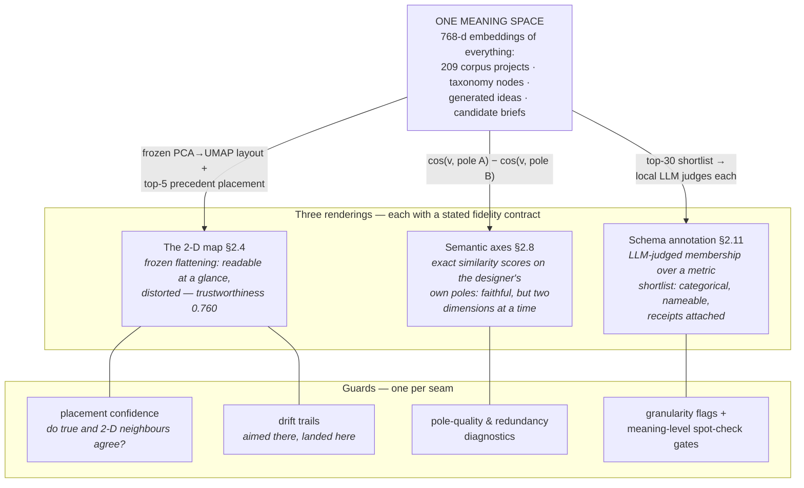
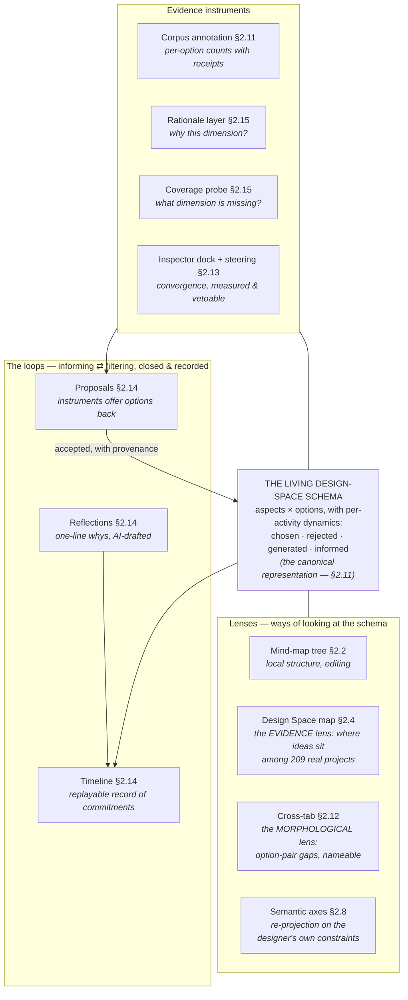
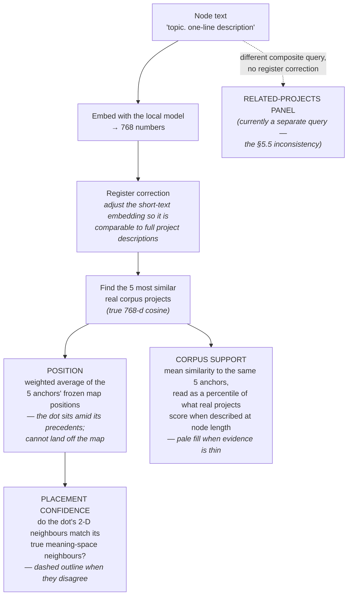
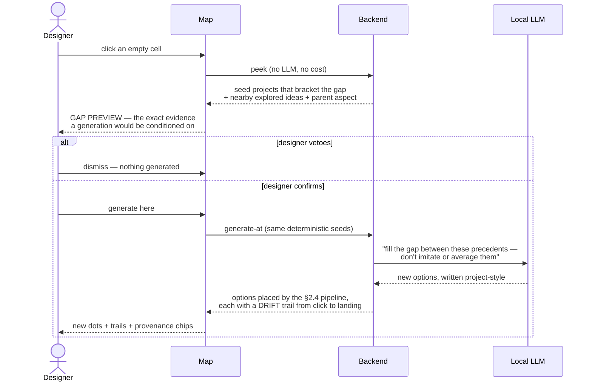
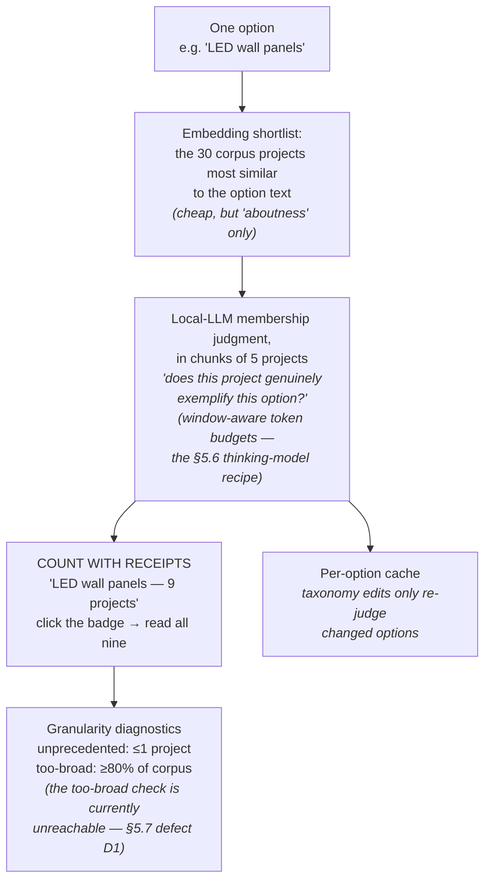

# LLMind — Unified Project Report & Critical Reflection

*Compiled 2026-06-11; updated 2026-06-12 with the placement iterations (§5: support
recalibration + evidence-anchored placement, ITERATION-PLAN Parts 10–11) and a
references section (§8); updated 2026-06-13 with the schema iterations (§5.6:
Iteration K's living schema, the design-language round, and Iteration L round 1 —
ITERATION-PLAN Parts 12–13), new feature entries (§2.11–2.16), and status markers on
the §6 ways forward, two of which are now paid; updated 2026-07-03 with a **full
code-verification sweep** — every load-bearing claim in §§1–5 was re-audited against
the implementation, corrections were applied in place (marked "[corrected
2026-07-03]"), diagrams and a plain-language glossary were added for
interaction-design readers, and a new §5.7 records the audit method, the confirmed
defects, and the documentation repairs; **§1.3** (same day, at the owner's request)
justifies each post-dissertation addition and maps the relationships among them —
the two-geometries rule, the guard instruments, and what remains unverified.
Supersedes-as-overview (does not
replace) the working documents now archived in
[`documentations/`](documentations/). Grounded in the original research dissertation
("Automated Generation and Exploration of Design Space with Large Language Models",
Uchikoga, USYD) from which the mind-map core of this system derives.*

---

## 1. What this project is

LLMind is a research prototype for **LLM-assisted design-space exploration**, currently
instantiated in the media-architecture domain. It descends directly from the
dissertation's framework and prototype:

- The **design space** is treated as a *dynamic, constraint-centered conceptual
  structure* — not a fixed list of alternatives. Aspects are dimensions of creative
  constraint; options are positions on those dimensions.
- Designers interact with that structure through two operations: **informing**
  (expanding the constraint configuration — new aspects, options, perspectives) and
  **filtering** (contracting attention — selecting, pruning, focusing). Divergence and
  convergence are both inside scope; the tool's job is to keep the designer *moving*
  between them instead of fixating.
- The structure is externalized visually, because external representations are
  *operative media*: they shape what both the human and the LLM can do next.

The dissertation's prototype implemented this as: LLM-generated taxonomy → interactive
mind map → related-precedent panel → "Explore with AI" expansion. Its single-participant
study found the generated dimensions **coherent and genuinely insight-producing**
("it expands to not just being creative, but also considerate"), but **perceived as
incomplete and unexplained** ("Why these seven though, is there a reason?"), and found
the mind map good for local exploration but weak for overview (the participant preferred
a table "because you can see everything at once" and proposed a hybrid).

The present system keeps that core and adds a second, *empirical* formalization of the
design space: a frozen 2-D embedding projection of 209 real projects, into which the
designer's evolving taxonomy, generated ideas, and composed design candidates are all
placed. Iterations A–J elaborated, corrected, and instrumented that bet. Iteration K
(2026-06-12) then **re-centered the system's deep model**: after re-reading the
design-space literature against the build, the canonical representation became the
**living design-space schema** (Halskov & Lundqvist's instrument — aspects × options
with per-activity dynamics), with every view — map, tree, cross-tab, axes — a *lens* on
it. The map is the evidence lens, no longer the thesis. Iteration L (2026-06-13) began
paying the dissertation's remaining findings directly (§5.6).

### 1.1 Technical terms, in plain language *(added 2026-07-03 for interaction-design readers)*

This report leans on a handful of machine-learning concepts. Each is defined here
once, in design-research terms; the rest of the document uses them freely.

- **Embedding.** A way of turning a piece of text into a long list of numbers
  (here, 768 of them) such that texts with similar *meaning* get similar numbers.
  Every project description and every taxonomy node gets a position in one shared
  "meaning space"; nearness in that space ≈ relatedness of meaning, as judged by a
  language model. (Model in use: a locally-run `nomic-embed-text-v1.5`.)
- **Cosine similarity.** The standard score for "how close are two embeddings"
  (1 = same meaning-direction, 0 = unrelated). When the report says *"true 768-d
  cosine"* it means similarity measured in the full meaning space, *before* any
  flattening to two dimensions — the faithful measurement.
- **Projection (PCA → UMAP).** Algorithms that flatten the 768-number positions
  onto a 2-D map so humans can see them. Like flattening a globe onto paper, this
  necessarily distorts. The report's **trustworthiness 0.760** quantifies the
  distortion: roughly, 76% of each point's true nearest neighbours survive as
  nearby points on the 2-D map (Venna & Kaski, 2001).
- **Frozen.** The 2-D layout was computed once from the 209 corpus projects and is
  never recomputed. New items are placed *into* the existing map rather than
  reshaping it — which is what makes positions stable across sessions and the map
  usable as a record of the exploration.
- **Top-5 neighbour placement ("evidence-anchored", a k-nearest-neighbour
  interpolation).** A new idea is positioned at the weighted average of the map
  positions of the 5 real projects most similar to it — literally "where its
  closest precedents already sit". Because a weighted average of positions inside
  the map cannot land outside it, "off the map" geometry is impossible by
  construction (§5.2 explains why that trade was taken).
- **Percentile.** "Your score beats X% of a reference group." Corpus support 84%
  means: this idea has as much nearby precedent evidence as the best-supported
  ~16% of real projects have for themselves, when they are described at
  comparable length.
- **Register (short vs long text).** The embedding of a two-line node label
  behaves differently from the embedding of a full project description — same
  topic, different *register* of writing. The register correction is a learned
  adjustment (fitted from the corpus's own short/long text pairs) that makes short
  node texts comparable to the long-description corpus.
- **Placement confidence (a Jaccard overlap).** For each placed dot, compare two
  top-10 neighbour lists — one measured in the full meaning space, one on the 2-D
  map — and score their agreement from 0 to 1. Low agreement = the 2-D position is
  an artifact; the dot renders dashed.

### 1.2 The system at a glance *(added 2026-07-03)*

```mermaid
flowchart LR
    subgraph designer["Designer's browser — llmind-web"]
        direction TB
        structure["Structure mode<br/>tree ⇄ schema table ⇄ cross-tab"]
        space["Design Space map<br/>corpus + ideas + candidates + gaps"]
        persp["Perspectives<br/>designer-defined axes & strips"]
        store["One shared exploration state<br/>(tree, coords, candidates,<br/>events, reflections — persisted)"]
        structure --- store
        space --- store
        persp --- store
    end

    subgraph backend["FastAPI backend — llmind-python"]
        direction TB
        tax["Taxonomy generation"]
        loc["Placement /locate<br/>+ support + confidence"]
        gen["Generate-at-gap, cross-tab cell,<br/>steering, reflections (async jobs)"]
        ann["Corpus annotation,<br/>rationale, coverage probe"]
        rel["Related-projects retrieval"]
    end

    subgraph local["Local model server (LM Studio)"]
        emb["Embedding model<br/>nomic-embed 768-d"]
        llm["Local LLM<br/>Qwen3.6 35B (thinking)"]
    end

    subgraph artifacts["Frozen artifacts — data/"]
        corpus["209 MAB projects<br/>+ 768-d embeddings"]
        surf["Frozen 2-D layout<br/>(48×48 lattice, density)"]
        rmap["Register map +<br/>short-register support baseline"]
    end

    designer -->|"direct HTTP (not proxied)"| backend
    backend --> local
    backend --> artifacts
```

*(An optional OpenAI path exists for taxonomy generation; every other LLM/embedding
call in the running configuration is local. The corpus was scraped from the Media
Architecture Biennale archive: 210 projects discovered, 209 indexed — one record is
dropped at indexing for having no usable description text.)*

### 1.3 What this system adds beyond the dissertation — justifications, and how the additions fit together *(added 2026-07-03)*

The dissertation's prototype contained four things: LLM taxonomy generation, the
interactive mind map, the related-precedents panel, and "Explore with AI"
expansion. **Everything else in this system is a post-dissertation addition**, and
this section owes each addition two accounts the feature-by-feature §2 does not
give: *why it was worth building at all*, and *how it relates to the others* —
because several additions only make sense as answers to problems that other
additions created. §2 describes the features; this section defends the system.

#### 1.3.1 Two kinds of additions — held to different standards

The additions divide into two epistemic classes, and the honest reading of this
report requires keeping them apart:

- **Debt-paying additions** — built to answer findings the dissertation's own
  study documented. The **schema table** (§2.11) answers P1's literal request
  ("a table where you can see everything at once"); the **rationale layer and
  coverage probe** (§2.15) answer "why these seven though… is there no more?";
  the **brief-first entry** (§2.16) answers "a tool where you can write down what
  you're imagining… and then it gives you ideas depending on that". These carry
  the strongest justification available to this project — a real user asked for
  them — but note the asymmetry: the *need* is evidenced; the *particular
  solutions built* are not yet validated by anyone.
- **New-bet additions** — the empirical ground layer, the map, aimed generation,
  candidates, steering, the honesty layer, the loops. These are justified below
  from the literature and from internal measurement, and **no external designer
  has used any of them** (§4.3). Every justification in this section should be
  read with that ceiling in mind; where a claim is testable only by the study,
  it is flagged inline with its probe (USER-TESTING-PLAN §9 / ITERATION-M M-R#).

#### 1.3.2 The foundational bet: one meaning space, several renderings, one rule

Every post-dissertation addition stands on a single substrate: all texts in the
system — the 209 corpus projects, taxonomy nodes, generated ideas, candidate
briefs — live in one 768-dimensional meaning space (§1.1). The additions are, in
essence, different *renderings* of that one space, plus instruments that guard
the seams between them:

The rule that disciplines the whole arrangement — stated here once, because
every relationship below instantiates it:

> **The renderings invite; the meaning space decides.** Any computation whose
> output a designer might *act on* — the relevance lens, corpus support,
> precedent retrieval, candidate neighbours, alignment scores, steering
> measurement, annotation shortlists — is computed in the full 768-d metric.
> The 2-D map's visible distances are never used as a measurement by the
> system itself. The map is a stage, not a ruler.

This rule is why the system can afford a distorted map at all: the distortion is
quarantined to *presentation*, and instruments exist to say where the
presentation misleads. Whether the *designer* obeys the same rule — or reads
pixel distance as similarity despite everything — is an open empirical question
and one of the study's placement probes *(unverified — M-R4, USER-TESTING-PLAN
§9.3)*.

#### 1.3.3 The relationships, mapped and justified

The user-visible additions pair up around specific tensions. Each row below
names the relationship, why both sides exist, and what remains unverified.

**(a) Map position vs the relevance lens — the worked example.** A node's map
*position* is a frozen summary: the weighted centre of its five most-similar
real projects' positions (§2.4). The *relevance lens* (§2.6) is a live query: it
recolours **every** corpus project by true 768-d similarity to one chosen
anchor. Both exist because they answer different questions at different costs.
Position answers "roughly where does everything sit?" continuously, for all
nodes at once, at zero interaction cost — and pays for that with 2-D distortion
(a project the layout placed far away may be genuinely similar). The lens
answers "how does the *whole field* respond to *this specific idea*?"
faithfully — including the secondary clusters of relevance the flattening
exiled to the far side of the map — and pays with interaction cost (pick an
anchor) and transience (one anchor at a time). The lens exists *because*
visible distance cannot be trusted for relevance reading; it is the faithful
overlay for exactly the judgment the map's geometry cannot support.
*Unverified:* whether designers grasp this division of labour or treat pixel
distance as relevance anyway; and §4.2 already flags that the lens's per-query
normalisation quietly invalidates its most natural use (comparing across
anchors) — a known, documented limitation, not yet a fixed one.

**(b) Position, corpus support, and the precedents panel — one evidence source,
with one honest exception.** Since Part 11, a node's position and its support
percentile derive from the *same five anchors* (§5.1–5.3): the dot sits amid
the projects that constitute its evidence, so position and evidence cannot
contradict each other the way they did in the LED incident (§5.1). The
deliberate cost of that coherence is the loss of a diagnostic tripwire (§5.4
weakness 3). **The honest exception:** the Related Projects panel still embeds
a *different* composite query with *no* register correction (§5.5, verified
again in the code audit) — so the five projects the panel shows are not
guaranteed to be the five that placed the dot. This inconsistency is documented
rather than hidden, and its repair (one query, one correction policy) is
ITERATION-M M-E11, deliberately deferred until after the pilot.

**(c) Placement confidence — the seam detector.** Confidence (the
true-vs-2-D neighbourhood agreement, §1.1) exists *only because* two geometries
exist. It is the instrument that polices relationship (a): when the meaning
space and the map disagree about a dot's neighbourhood, the dot renders dashed.
It flags, it does not fix — a dashed dot still *has* a position, and positions
invite reading (§5.4 weakness 2). *Unverified:* whether the dashes are noticed
at all (M-R4).

**(d) Two kinds of gap — spatial and categorical.** The map renders gaps as
*empty regions between precedents*: suggestive, explorable by wandering,
inherently diffuse (an empty region might be a real void or a flattening
artifact). The cross-tab (§2.12) renders gaps as *empty option-pairs*: exact,
nameable ("no project combines transit-hub siting with live performer input"),
checkable against the receipts. Both feed the same generation machinery, seeded
by the precedents that surround the gap. The justification for keeping both is
that they serve different cognitive moments — the map invites divergent
wandering; the cross-tab supports claims and briefs — and the study's T3
deliberately offers both to see which designers reach for *(the choice itself
is a study measure)*.

**(e) Drift — honesty at the seam between aiming and landing.** A generate-at
click is an intention expressed in 2-D; the generated ideas are placed by their
*meaning* in 768-d. Drift (the trail from click to landing, §2.5) is the
measured difference between the two — the system showing, rather than hiding,
that aiming on a stage does not guarantee landing on the stage's target.
*Internally measured* (drift statistics per prompt/seeding variant, §2.17);
*unverified* whether trails read as honesty or as noise to a designer.

**(f) Candidates and steering — the same space, used for convergence.** A
candidate is a *composition* (one option per aspect) plus a *brief* — and both
layers embed into the same meaning space, which is what makes the convergence
instruments possible: the star's position and precedent neighbours come from
the same placement pipeline as everything else; the **alignment score**
measures the agreement between the candidate's two layers (does the brief say
what the choices commit to?); **steering** revises the brief in language only,
then uses embedding deltas to *measure* the move (requested vs achieved, along
vs orthogonal) — deltas as rulers, never constructors (PROCESS §3). This is the
§1.3.2 rule applied to the system's only write-access to designer text: the LLM
may propose, the metric may measure, only the designer commits (veto cards,
§2.13). *Internally verified* (live steering run: requested +0.70, achieved
+0.22 — the instrument detects under-delivery, which is precisely its job);
*unverified* whether single-move-measured-vetoable steering is *useful*, and
the achieved-vs-requested gap suggests the local model's moves are small —
whether that frustrates or reassures designers is a study question.

**(g) Two kinds of "how precedented" — support vs annotation counts.** Corpus
support (§2.7) is a *metric inference*: mean similarity to the nearest five,
read as a percentile — continuous, cheap, available for any text, but blind to
*what kind* of similarity. An annotation count (§2.11) is a *judgment*: the
local LLM reads each shortlisted project and answers "does this genuinely
exemplify this option?" — categorical, nameable, receipt-backed, but only
defined per option and only over the judged shortlist. They can disagree, and
that disagreement is informative: high support + low count suggests an idea
that is *near* much real work without being *of* it. The mean shortlist
acceptance (~0.26 on the current cache) is the standing evidence that the
judgment layer filters rather than rubber-stamps the metric's shortlist.
*Honest caveats:* the judge's quality is assured by meaning-level spot-check
gates (the LED probe), not by systematic validation; the D2 parser defect
(§5.7) silently zeroed some judgments until 2026-07-03, and the cache re-run
under the fixed parser is still pending — the counts currently on screen
predate the fix.

**(h) The rationale layer and coverage probe — the structure explaining
itself, within limits.** Both are grounded in the annotation counts (g): the
rationale drafts "why this dimension" *from the evidence*, the probe finds the
corpus projects the taxonomy fails to describe and asks what dimension they
exemplify. Their justification is direct (the dissertation's central trust
finding), but §5.6 weakness 1 stands: a post-hoc explanation generated by the
same model that generated the structure can *read* grounded without *being*
calibrated — the planted-dimension probe (USER-TESTING-PLAN §9.1, pending
adoption) is the designed test of exactly that failure mode. Structure-level
proposals may also anchor harder than option-level ones (Wadinambiarachchi's
fixation risk moved up a level) — measurable from the event log (M-R3).

**(i) The loops and the timeline — the framework, made mechanical, recording
commitments only.** Proposals, reflections, and the replayable timeline close
the informing↔filtering cycle the whole framework is named for (§2.14), with
provenance on every accepted item. The record is deliberately a record of
*commitments*: what was looked at and silently rejected is invisible (§5.6
weakness 3), so the "reflective record" claim must always be read as
"…of decisions", not "…of attention".

#### 1.3.4 How it composes — the journey the additions jointly support

Read as one system, the additions form a loop the dissertation's prototype
could not close: **structure** (brief → schema, with rationale) → **evidence**
(receipts, map, lens — every abstraction anchored in nameable precedent) →
**aimed divergence** (gaps, spatial or categorical, filled with
evidence-conditioned generation) → **measured convergence** (candidates,
alignment, steering — with veto) → **record** (timeline, reflections,
provenance) → back to structure (proposals, the coverage probe growing the
schema). Two invariants make the loop trustworthy at every arrow: the
**one-metric rule** (§1.3.2 — judgments computed faithfully, renderings only
display) and the **veto rule** (nothing the AI produces enters the designer's
structure or text without an explicit accept — chips, cards, previews).

The honest system-level summary, in one table:

| Addition | Class | Standing justification | What would falsify it | Status |
|---|---|---|---|---|
| Ground layer (corpus + frozen map) | bet | precedent-grounding fixes Luminate's ungrounded-dimension weakness; frozen coords make exploration cumulative | designers ignore precedents / corpus too small or biased to ground judgments | internally measured; single-domain, n=209 — generality unknown (§6 item 7) |
| Evidence-anchored placement + support + confidence | bet | position/evidence coherence (§5.2); measured better than the alternative on round-trips | false-familiarity: designers over-trust in-footprint positions and never read the fill (§5.4 w1) | measured on a proxy; designer reading unverified (M-R4) |
| Relevance lens | bet | faithful relevance reading where 2-D distance lies | nobody uses it; or cross-anchor comparison misuse dominates (§4.2) | built; usage unverified |
| Gap preview + generate-at | bet | aimed informing chat cannot express; evidence veto before LLM spend | generated ideas don't actually fill gaps (drift ≫), or preview unread | drift instrumented; meaning-level "in-between-ness" partially verified |
| Schema + annotation receipts | debt-paying | P1's overview request; Halskov's practice, automated | counts distrusted despite receipts; judge unreliable at scale | gate-passed; D2 re-run pending; trust-delta probe pending |
| Cross-tab + generate-into-gap | bet | exact nameable gaps (Zwicky with receipts) | designers prefer the map's diffuse gaps for everything | built; T3 measures the choice |
| Candidates + alignment + steering | bet | configurations need representation; convergence with honest instruments | single measured moves feel useless vs chat's fluid iteration | internally verified; usefulness unverified |
| Rationale + coverage probe | debt-paying | P1's "why these seven / is there no more" | rationale buys uncalibrated trust (accepts the plant) | built; calibration probe pending adoption (M-R9c-5) |
| Loops + timeline | bet (framework-completing) | informing↔filtering closed and recorded; burden-inverted reflection | record never revisited (VP4 bet fails) | built; revisit-behaviour is a study measure |
| Honesty layer | bet (meta) | calibrated trust is the difference between a picture and an instrument | signals unread → pure UI cost (§4.2's collapse argument wins) | measurements sound; readership unverified (M-R4) |

The pattern across the Status column is the report's standing self-critique in
miniature (§4.3): the *measurable-without-users* half of every justification is
done; the *does-it-help-a-designer* half is uniformly pending, and pends on one
thing — the study.

---

## 2. The system as a logic chain: feature → what it does for the designer

The features are listed in the order a designer would meet them, and each is tied to the
mechanism it relies on and the *specific* contribution it makes to design thinking. The
informing/filtering vocabulary is the dissertation's.

*Reading note (2026-06-13): the order below is chronological-by-encounter, which no
longer matches the architecture's hierarchy. Since Iteration K the canonical
representation is the living design-space schema (§2.11); the map (§2.4), axes
(§2.8), and cross-tab (§2.12) are lenses on it — see the §3 addendum.*

*The architecture-as-it-stands, visually (added 2026-07-03):*

### 2.1 Taxonomy generation (project brief → structured dimensions)
**Mechanism:** the designer writes a project overview; the LLM, prompted with a fixed
exemplar set of 50 corpus projects (pre-selected for diversity by farthest-point
sampling), returns Aspects/Options with descriptions in one structured call.
*[Corrected 2026-07-03: this section previously claimed "self-reflection rounds,
retrieval over the corpus". The code audit found neither is true of the running
system — the dissertation-era Self-Refine loop exists in the code but is commented
out (`generate_taxonomy.py:225–242`; the `num_reflections` API parameter now only
alters prompt wording), and the corpus grounding is the fixed exemplar set, not a
per-query retrieval. The claim as previously written overstated the mechanism; §5.7
logs this as an audit finding and a candidate for re-enabling.]*
**Contribution:** *informing at the domain level.* This is the dissertation's
"conceptual primer" — its study showed it surfaces constraints a designer's initial
mental model omits (the participant immediately recognized environmental data and
mobility as considerations their past studio project had missed). It converts the blank
page into a manipulable constraint structure within seconds, which is exactly the
cognitive-cost problem (Horner & Atwood, 2006) the design-space literature identifies.

### 2.2 The mind map (manipulable constraint structure)
**Mechanism:** the taxonomy rendered as an editable radial tree (add, rename, delete,
re-organize; selection drives every other panel).
**Contribution:** *filtering made physical.* Choosing where to look, pruning branches,
and renaming nodes are constraint manipulations — the literature's core requirement that
constraints be "explicit, manipulable entities". The dissertation validated the metaphor
(self-explanatory to a novice) while flagging layout/overview weaknesses — which is one
of the standing reasons the spatial view exists.

### 2.3 Related precedents (every abstract idea, anchored in real work)
**Mechanism:** a composite query for the selected node — its ancestry path, its
description, and its label, joined as `lineage | description | topic` — is embedded
and matched against the scraped MAB corpus; matching projects (name, description,
image) appear beside the map. *(Precision note 2026-07-03: this query is embedded
raw, without the register correction that placement applies — the §5.5
retrieval-inconsistency finding, re-confirmed in the code audit; unification is §6
item 5's prerequisite.)*
**Contribution:** *grounding.* An option stops being a plausible-sounding LLM phrase
and becomes "a thing real designers have built, here are five of them". This is both an
interpretability device (what does 'kinetic facade' actually mean in practice?) and a
fixation counterweight — the precedent set pulls attention outward to work the designer
has not seen.

### 2.4 The Design Space view (the embedding bet)
**Mechanism:** a frozen PCA→UMAP projection fit once on the corpus embeddings; corpus
projects are diamonds, taxonomy nodes are colored dots placed at the similarity-weighted
centroid of their top-5 corpus precedents (evidence-anchored placement, Part 11 — the
same anchors that drive corpus support), density shading shows where real work clusters,
and a 48×48 lattice of clickable empty cells covers the rest. Selection is shared with
the mind map — two views, one state.

*How one dot gets its position, its evidence score, and its trust cue — one pipeline,
one set of anchors (added 2026-07-03; verified against `backend/projection/service.py`):*

**Contribution — four distinct ones:**
1. **Overview.** The whole exploration is visible at once in a stable frame — the thing
   the dissertation's participant asked for and the mind map could not give.
2. **Neighborhood reasoning.** "My idea sits among *these* real projects" is a judgment
   the tree cannot express at all. Proximity, painted honestly (see 2.7), lets the
   designer read affinity and difference spatially.
3. **Gaps as first-class objects.** Empty regions *between real work* are visible,
   pointable territory. The classical morphological promise — see what has *not* been
   tried — gets an empirical rendering: unexplored ≈ no precedent nearby.
4. **A stable map of the journey.** Because coordinates never relayout, the designer's
   accumulated ideas, candidates, and discoveries stay where they were — the view doubles
   as a record of the exploration (the "evolving, not snapshot" requirement).

### 2.5 Generate-at-gap with preview (aimed informing)
**Mechanism:** clicking an empty cell opens a **gap preview** — the real projects that
bracket that location (deterministic seeds), nearby already-explored ideas, and which
aspect new options would join — *before* any LLM time is spent. Confirming runs a
location-conditioned generation: seeds that surround the gap, an explicit
"fill the gap, don't imitate or average" prompt, descriptions written project-style,
and the result drawn with a trail from the clicked cell to where each idea actually
landed (drift), parented under the spatially-nearest aspect.

*The interaction, as a sequence — the designer sees and can veto the evidence before
any generation happens (added 2026-07-03):*

**Contribution:** *informing with intent.* Standard LLM ideation answers "give me more
like X". This answers "give me what belongs in the space between these precedents that
nobody has built" — a question a designer cannot even pose in a chat interface. The
preview step doubles as transparency: the designer sees and can veto the evidence the
generation will be conditioned on (a direct answer, at interaction level, to the
dissertation's finding that unexplained AI structure erodes trust).

### 2.6 Relevance lens (query-responsive painting)
**Mechanism:** toggle the lens, pick an anchor (selected node or active candidate);
every corpus project is recolored by its **true 768-d cosine similarity** to the anchor
(cool→warm), bypassing 2-D distortion entirely.
**Contribution:** *filtering the precedent field through one idea.* Where the related
panel gives the top-5, the lens shows the **whole landscape's response** to an idea —
including secondary clusters of relevance in regions the 2-D layout placed far away.
Most valuable with a candidate as anchor: "where does my composed design resonate
across everything that exists?"

### 2.7 The honesty layer (calibrated trust in the map)
**Mechanism:** every claim the map makes carries a measured caveat — layout
**trustworthiness** (0.76) in the legend; per-node placement **confidence**
(true-vs-2D neighborhood overlap; dashed when low); per-node **corpus support**
(percentile of real-metric evidence; washed-out fill when low — since Part 11 this is
also the *only* outsideness signal: placement is a convex combination of precedent
positions, so "off the map" geometry can no longer occur, and the retired "beyond
corpus range" band's job moved to the channel that was honest all along); generation
**drift** drawn as trails rather than hidden.

*Each signal answers exactly one question a designer might wrongly assume the map has
already answered (added 2026-07-03):*

| Signal | The question it answers | Where it shows | Plain reading |
|---|---|---|---|
| **Trustworthiness** (0.760) | "How faithful is this whole 2-D layout to true similarity?" | legend, once | ~¼ of true neighborhood structure did not survive flattening — read regions, not exact distances |
| **Placement confidence** | "Is *this dot's* position among its true neighbours?" | dashed outline per dot | dashed = the 2-D spot disagrees with the meaning-space evidence — trust the precedents panel, not the pixel |
| **Corpus support** | "How much real precedent evidence exists for this idea at all?" | fill strength per dot | washed-out = little precedent — possibly novel, possibly vaguely phrased; the receipts tell which |
| **Drift** | "Did the generated idea actually land where I aimed?" | trail from click to dot | long trail = the LLM answered a nearby question, not the one the click asked |
**Contribution:** *the difference between a picture and an instrument.* A designer can
act on spatial claims only if the tool says when they are unreliable — and "this idea
has little precedent evidence" is itself design information (it may mean *novel*, or
*incoherently phrased*; the support score plus precedents lets the designer tell which).
This layer is also the project's scientific answer to the known failure mode of evocative
spatial visualizations (see §3).

### 2.8 Perspectives / semantic axes (designer-defined dimensions)
**Mechanism:** pick two aspects; each becomes a bipolar axis between two of its option
poles; corpus and options are scored by exact cosine difference — no UMAP, no
stochasticity — with diagnostics that warn when poles are too similar or axes redundant.
**Contribution:** *re-projection on the designer's own terms.* The UMAP map's axes mean
nothing; here the axes are the designer's constraints, so an empty quadrant has a
readable morphological meaning: "no real project is strongly ⟨A⟩ *and* strongly ⟨B⟩."
It is the one view where the literature's design space and the visualization coincide
exactly.

### 2.9 Design candidates (a point in the space is a *configuration*)
**Mechanism:** compose one option per aspect (from any view, including a click-to-pick
flow in the mind map); the composition is embedded and drawn as a star on the map; its
closest real precedents are retrieved in the true metric; candidates can be compared and
exported; rejecting an option visibly invalidates candidates that used it.
**Contribution:** *closing the deepest conceptual gap.* In morphological terms a point
in a design space is a combination of choices — not an option, not a project. Until
Iteration C the system had no representation of the very object designers are trying to
create. The star + its precedent neighborhood + comparison turns the map from "a field
of fragments" into a place where *designs* can be positioned, judged against precedent,
and contrasted — convergence support inside a divergence tool.

### 2.10 Memory of the exploration (provenance, sessions, stats, export)
**Mechanism:** generated nodes carry provenance (which click, which seeds); the whole
exploration state saves/loads as versioned JSON; a live strip counts options, generated
ideas, rejections, explored cells, candidate diversity; export produces a markdown
record of the structure, choices, and evidence.
**Contribution:** *reflection and accountability* (Dove et al., 2016, "design space
reflection"): the record of *why an idea exists* and *what the exploration covered* is
what lets a designer — or a researcher — revisit, justify, and resume. These are also,
explicitly, the study instruments for evaluating everything above.

### 2.11 The design-space schema with annotation receipts (Iteration K, A1–A3)
**Mechanism:** aspects × options as a pan-zoomable table — the literature's canonical
representation and the dissertation participant's literal request ("a table where you
can see everything at once"). A local-LLM **annotation job** judges, per option, which
corpus projects genuinely exemplify it (embedding shortlist → chunked membership
judgments) → per-option **counts with receipts** (click a badge, read the projects),
Halskov-granularity diagnostics (too-broad / unprecedented), and ± **facets** that fade
non-matching projects on the map. Cell styling carries the living-schema dynamics:
ring = chosen, struck = rejected, italic = informed.

*The annotation pipeline — how a count earns its receipts (added 2026-07-03; verified
against `backend/corpus/annotate.py`):*

**Contribution:** *the overview debt paid, with evidence attached.* Counts are evidence
with receipts, never verdicts — the corpus⇄taxonomy bridge Halskov annotated by hand,
automated. This is what §6 item 5 asked for ("support → receipts") at the categorical
level: the designer reads "LED wall panels — 9 projects" and can name all nine.

### 2.12 The cross-tab lens and generate-into-gap (Iteration K, B2)
**Mechanism:** pick two aspects → an option×option grid from the annotation; each cell
lists the real projects committing to BOTH options; an empty cell is an **exact,
nameable gap** ("no precedent combines transit-hub siting with live performer input"),
offered as a one-click generation seeded with half-matching precedents; a kept concept
becomes a candidate skeleton (the two choices + the concept as brief).
**Contribution:** *the morphological promise, sharpened.* The map renders gaps as
diffuse empty regions; the cross-tab renders them as named, checkable combinations —
Zwicky's combinatorics with receipts. Where 2.5 aims generation at a place, this aims
it at a *configuration*.

### 2.13 The inspector dock and steering (Iteration K, B1 + B3)
**Mechanism:** while a candidate is active, its examination strips (concept↔commitments
agreement, per-choice consistency, rubric metrics over the corpus distribution) dock
into the map view. Every strip track is a **steering rail**: click or drag to aim a
target score (Steer/Cancel live in the same card), and the LLM makes ONE deliberate
revision of the brief *in language*, preserving committed choices; embeddings then
**measure** the move (requested vs achieved, along vs orthogonal) and the result is
always a veto card.
**Contribution:** *convergence with honest instruments.* The §4.2 critique ("Perspectives
is a researcher's instrument wearing a designer's UI") is *substantially* answered by
integration — the strips now live in the designer's loop (the standalone Perspectives
mode remains; see §4.2's status note) — and the system's one write-access to the
designer's text is single-move, measured, and vetoable — deltas as rulers and briefs,
never constructors.

### 2.14 The loops: proposals, reflections, the timeline (Iteration K, C1–C3)
**Mechanism:** (C1) any instrument may emit *proposals* — applied steers offer their
named qualities as options; kept cell concepts offer themselves under both parent
aspects — as accept/dismiss chips; accepted ones enter the taxonomy with provenance.
(C2) after each commitment a chip offers an AI-drafted ONE-LINE rationale — Enter
accepts, typing edits (tracked), Esc skips. (C3) an append-only event log renders as a
Fusion-360-style **timeline**: icon markers per step, scrub to see the schema as it
stood (read-only, ghosted not-yet options, the step's subjects outlined), reflections
on markers, and **Reconsider** for dismissed suggestions.
**Contribution:** *the informing↔filtering cycle, closed and recorded — as
commitments* (what was looked at but not acted on stays invisible, a deliberate
trade examined in §5.6 weakness 3). C1 is the TOCHI loop made mechanical
(investigation generates vocabulary); C2 inverts the documentation burden that
killed process-reflection tools (Dalsgaard & Halskov, 2012); C3 is the
dissertation's named future work ("temporal layers… record and compare") — record
and replay built, compare deliberately deferred (ITERATION-PLAN K9).

### 2.15 The rationale layer and coverage probe (Iteration L, L-A)
**Mechanism:** one line per aspect — "why this dimension?" — generated from the
annotation counts (cached per aspect+evidence), shown under schema headers and in the
Context panel, labelled *AI, from corpus evidence*. The **coverage probe** computes
which corpus projects the taxonomy barely describes (pure set arithmetic) and asks, on
demand, what dimension they exemplify that the taxonomy misses; answers arrive as
"Add as a new dimension?" chips whose acceptance grows the schema (first live probe:
"Spatial-Perceptual Integration", from the 5 worst-covered projects).
**Contribution:** *the rationale debt paid, structurally.* "Why these seven though, is
there a reason? Is there no more?" was the study's central trust finding; the rationale
*addresses* the first half where the question arises, and the probe addresses the
second half with evidence-backed candidates — informing at the *structure* level,
through the same veto-able proposals channel as everything else. Two open questions
travel with the feature (examined as §5.6 weaknesses 1–2): whether labelled post-hoc
rationale buys *calibrated* trust rather than just more of it, and whether
dimension-level proposals anchor harder than option-level ones.

### 2.16 Entry choice and the editable project brief (Iteration L, L-B)
**Mechanism:** a once-only first-run dialog — **Start from your brief** (write what you
imagine; the taxonomy dialog's overview field is the brief) vs **Discover first** (the
prebuilt space). The brief persists; after the first generation the navigator button
becomes **Edit Brief & Taxonomy**, reopening the dialog prefilled.
**Contribution:** *the layered inform→filter model the participant asked for* ("a tool
where you can write down what you're imagining… and then it gives you ideas depending
on that") — without forcing it on designers who'd rather see the territory first.

### 2.17 Researcher backstage (not designer-facing, by design)
Drift/clip/support logging per generation; generation/steer/annotation logs;
`project-log-stats`, `project-calibrate`, `project-align`, `project-diagnose` CLIs;
register-gap correction; 218 automated checks across both stacks as of 2026-07-03
(152 backend — 139 runnable offline, 13 gated behind live-server flags — and 66
frontend; the backend counts one `check()` assertion as one test case in its
no-dependency harness; the previously cited 134/66 was the 2026-06-13 snapshot,
counted the same way), plus meaning-level manual walkthroughs (TESTING §6–15).
**Contribution:** the validity case. None of the designer-facing claims above (gaps are
meaningful, placements are usable, generation fills gaps, annotation counts are real)
is left as an assertion — each has a number, a log, and a reproducible check behind it.

---

## 3. The point-cloud argument, revisited with evidence

The dissertation reviewed three representation traditions and rejected each in part:
QOC trees (rigorous but rigid, no ripple effects), the **Design Space Schema** (pragmatic
but static), and **Heape's point clouds** — dynamic and evocative, but "dense and
idiosyncratic, requiring extensive explanation… more inspirational artifacts than
practical tools for systematic reflection, communication, or comparison." Mind mapping
was chosen as the workable compromise.

The post-dissertation argument embodied in this codebase is: **embeddings change the
point-cloud verdict.** The assessment, grounded in what was actually measured here:

**What embeddings genuinely fix about point clouds:**
- **Idiosyncrasy → shared geometry.** Heape's clouds were hand-authored; every diagram
  needed its author. Here positions are computed from data under one frozen metric —
  the same idea lands in the same place tomorrow, for anyone.
- **Inspirational → queryable.** The map answers questions: what is near this point
  (seeds), how relevant is everything to this idea (lens), where does my *composition*
  sit (candidates), what lies between these precedents (generate-at). A hand-drawn cloud
  answers none.
- **Uninterpretable → anchored in precedent.** Regions mean something because real,
  inspectable projects occupy them. Interpretation-by-example replaces
  interpretation-by-author.
- **Incomparable → cumulative.** The frozen projection makes explorations comparable
  across sessions, users, and (eventually) studies — the property Heape's notation
  most lacked.

**What the project's own measurements say the embedding map is — and is not:**
- Trustworthiness 0.760 at k=15 (Venna & Kaski, 2001): about a quarter of true
  neighborhood structure does not survive projection. Corpus self-confidence ≈ 0.25.
  Before Iteration H, 47% of generated ideas silently pinned to the surface edge; the
  register fixes (Part 9) then cut held-out short-text displacement only modestly
  (~12 lattice cells), and Part 11 located the residual culprit in the *placement
  mechanism itself*: UMAP's out-of-sample transform mis-flagged 30–35% of **real
  corpus projects** as "beyond corpus range" on round-trips of their own short texts.
  Replacing it with evidence-anchored interpolation (§5) cut median displacement to
  ~8 cells and made off-the-map geometry structurally impossible.
- Corpus support, after the Part 10 recalibration, is read against what a real project
  scores *when described at node length* — under the old full-register yardstick every
  node-length text flattened toward the 0th percentile regardless of how precedented
  the idea was. The default taxonomy now spans 0–66% (mean 18%), so corpus poverty is
  finally legible per category instead of uniform noise.
- Therefore the honest claim is: **the map is meaningful and precise as *relative
  neighborhood structure over precedent evidence* — not as absolute coordinates.** Dots
  are neighborhoods, not positions; gaps are "no precedent nearby", not guaranteed
  voids; positions of ideas phrased unlike project descriptions are extrapolations and
  are now visibly marked as such.
- A subtler conceptual limit (Iteration-plan Part 2): an embedding manifold is a
  similarity landscape of *texts*. It is not, by itself, the morphological space of
  *configurations* the literature means by "design space". The candidate stars and the
  semantic-axes view are precisely the bridges built over that gap — one places
  configurations into the landscape, the other rebuilds axes that mean what the
  designer's constraints mean.

**Verdict:** the argument survives contact with the evidence, with one inversion worth
stating plainly. Heape's clouds failed because they required *extensive explanation*.
The embedding map **also requires explanation** — legend, confidence, support — but the
explanation is now quantitative, per-element, and machine-generated rather than
idiosyncratic and authorial. The cost did not disappear; it became measurable and
honest. Part 11 sharpened the inversion: one entire explanation (the "beyond corpus
range" band) was deleted not by hiding it but by making the geometry incapable of
producing the artifact it explained. That is a real and defensible improvement, and the
remaining explanations are still a UX burden the next iteration must reckon with
(see §4).

**Addendum (2026-06-13): the argument was right, and it lost the center anyway.**
Iteration K re-read the representation traditions against the build and re-centered the
system on the one the dissertation had judged "pragmatic but static": the **Design
Space Schema**, made *living* — populated by automated corpus annotation (per-option
counts with receipts), styled with per-activity dynamics, replayable in time, and
since Iteration L able to explain its own dimensions. The embedding map keeps every
property argued above, but as the *evidence lens* on the schema rather than the
system's deep model. This also closes the §3 conceptual limit ("a similarity landscape
of texts is not a morphological space of configurations") by a categorical route the
geometric bridges could only approximate: the schema, its cross-tabs, and its
annotation ARE the configuration space, with the map supplying the precedent
neighborhoods underneath. The point-cloud verdict stands; it just stopped being the
thesis.

---

## 4. Critical reflection: what tightly serves the core purpose — and what doesn't

Core purpose, restated from the dissertation: *help designers diverge — construct,
navigate, and reshape a constraint-centered design space; surface overlooked
perspectives; resist fixation; keep the designer in the informing↔filtering loop.*

### 4.1 Tightly connected
- **Taxonomy → mind map → precedents** — the validated core; the only part any real
  user has ever touched (P1), and the dissertation's evidence is positive on exactly
  the core-purpose terms (surfaced implicit constraints, broadened framing).
- **Design space + gap preview + generate-at-gap** — the strongest *new* contribution:
  it operationalizes "explore what hasn't been tried" in a way chat interaction
  structurally cannot, and the preview keeps the designer in command of the evidence.
- **Candidates** — closes the configuration gap; gives divergence a destination
  (convergence with provenance).
- **The living schema + annotation receipts** *(built 2026-06-12, directly off the
  dissertation findings — §2.11, §5.6)* — answers the one overview demand a real user
  voiced, and grounds every count in nameable evidence; the strongest claim to
  "tightly connected" any feature has, since the connection runs through P1's own
  words. Note the recency: a long-standing gap closed days ago, not a mature feature.
- **The loops (proposals / reflections / timeline)** *(built 2026-06-12 — §2.14,
  §5.6)* — the informing↔filtering cycle the whole framework is named for, made
  mechanical and recorded; also the study's richest instrument.

### 4.2 Loosely connected, with reasons

- **The Perspectives (axes) view.** Conceptually the purest feature in the system — and
  the most disconnected in practice. It is read-only (no generation, no candidate flow),
  lives behind a third navigator tab, and demands the most statistical literacy (bipolar
  cosine scores, pole quality, axis correlation). Nothing in the designer's journey
  *leads* to it. As shipped it is a researcher's instrument wearing a designer's UI.
  **Either integrate it into the loop (generate-in-axes, candidate reading as a
  consistency check, axes suggested from the designer's current focus) or demote it to
  a diagnostic.** Its current state is the clearest case of W1 (feature accretion).
  *(Status 2026-06-13: substantially answered by integration — the strips became the
  Inspector dock inside the map view, every strip track became a steering rail
  (§2.13), and the cross-tab's "show as continuous scatter" now leads into the axes
  tab. The standalone Perspectives mode remains, and the K5 lens-bar end state — which
  would dissolve it — is still an open decision.)*

- **The relevance lens.** Honest and cheap, but its designer task overlaps the related-
  projects highlight it generalizes, and the per-query "relative" normalization makes
  cross-anchor comparison — its most natural use — quietly invalid. Candidate-anchored
  relevance is its one distinctive job; consider reducing the feature to exactly that.

- **The honesty stack, as UI.** Four distinct epistemic signals still share one canvas
  (trustworthiness, confidence dashes, support fill, drift trails — the margin band
  retired in Part 11, its job folded into support). Each is
  individually justified; together they ask the designer to learn a visual epistemology
  before trusting a single dot. The *measurements* are core-purpose (they are what makes
  the map an instrument); the *presentation* has drifted toward serving the research
  argument rather than the design flow. **Collapse to one designer-facing trust cue**
  (e.g. a single "how seriously to take this dot" encoding with a tooltip), with the
  full decomposition in a diagnostics drawer.
  *(Status 2026-06-13: the language half is done — a six-lens heuristic review drove a
  plain-words pass ("map reliability: how faithful the 2D layout is", corpus support
  explained in terms of precedents, cell grammar decoded at the header) and a locked
  design language: hierarchy by luminance, one hue per meaning, never dark-border
  emphasis (FRONTEND.md §Design language). The single-cue collapse itself remains
  open.)*

- **The lattice itself deserves the question.** The 48×48 grid was a presentation
  convenience (clickable empty cells) that has since generated its own feature debt:
  collision badges, cell-snapping, "discovered cells", cell-granular stats. Designers
  think in ideas and regions, not cells. The gap *preview* — not the grid — turned out
  to be what makes empty space explorable. A continuous surface with freeform
  "generate around here" targeting could delete an entire family of micro-features.
  *(Status 2026-06-13: still undecided, but the question has lost urgency — the
  cross-tab now provides the sharper gap object (a named option pair) for the cases
  that matter most, so the lattice carries less of the morphological load.)*

- **Session/usage/stats instrumentation** is scaffolding for the study, not designer
  value — correctly built, but it should be counted as method, not feature, when
  weighing where effort goes next.

### 4.3 The honest accounting

How much did the approaches actually help the objective? Split the claims:

- **Technical claims — measured, mostly held.** Coordinate stability, bracket seeding,
  drift, clipping, the register gap: all instrumented, several already corrected on
  evidence (47% clip → diagnosed as register gap → prompt + alignment + soft margin).
  The annotation layer joined this class with its own gate (a full-table spot-check
  against ground-truth expectations before any count was trusted — §5.6). This part of
  the project practices what it preaches.
- **Design claims — still hypotheses, but the asks are now built.** *No external
  designer has used any post-dissertation feature* (the owner's defect-finding use —
  §5.5, §5.6 — is real evidence about correctness, not about design value). The
  feature→value chain in §2.4–2.17 is plausible, internally coherent, instrumented —
  and unvalidated. What HAS changed since this section was first written: the two
  needs P1 actually voiced are no longer unserved. **Overview** is the schema table
  (§2.11 — the participant's literal request, built as the canonical view), and
  **rationale** is the rationale layer + coverage probe (§2.15 — "why these seven?"
  answered where the question arises, "is there no more?" answered with evidence).
  Both went from "three years old and unimplemented" to shipped within two days of
  re-reading the dissertation; what remains unproven is whether they produce the
  trust the study found missing — which is precisely what the drafted testing plan's
  trust-delta probe measures.
- The risk this pattern named — optimizing what is *measurable without users* over
  what the one real user asked for — was partially answered by Iterations K–L (pulled
  directly by the dissertation's findings, §5.6), but its sharpest form now points at
  one target: every day of further building without running the study adds to a
  hypothesis pile that only participants can convert into knowledge. The study is the
  bottleneck, and it is now also the only remaining item with zero progress (§6
  item 2).

---

## 5. The iterations of 2026-06-12/13: placement, then the living schema

§5.1–5.5 cover the placement round; §5.6 covers what followed the same week —
Iteration K (the schema re-centering) and Iteration L round 1; §5.7 (added
2026-07-03) records the code-verification sweep that audited this report against
the implementation.

Two observations — both made by the project's owner *while actually using the tool* —
drove one more round of geometry work. The full record (diagnostics, alternatives,
measured results) is ITERATION-PLAN Parts 10–11; this is the report-level account and
its critical reading.

### 5.1 What was done

1. **Corpus support recalibrated** (trigger: *"many nodes show ~0% support — is this
   normal?"*). The support percentile was being read against the corpus's
   full-description self-support — a yardstick node-length text structurally cannot
   reach (real corpus projects, re-described in two sentences, averaged 11%; "Public
   plaza/square" scored 0% despite abundant precedent). The metric was signalling text
   length, not evidence. Fix: `project-align` now also fits and persists a
   **short-register support baseline** (out-of-fold corrected short corpus texts,
   self-excluded); `/locate` reads support as "as much corpus evidence as a real
   project described at this length." Validated spread: LED wall panels 33%→84% on the
   crafted probe, default-taxonomy mean 18%, honest zeros only for genuinely thin
   categories.
2. **Stale-value refresh.** The recalibration was then invisible in the UI — coords
   (with their support) persist in localStorage and only missing nodes were ever
   re-located, so values cached under the old calibration never updated. Every node now
   re-locates once per session. A small fix with a methodological moral (§5.4).
3. **Evidence-anchored placement** (trigger: *"LED wall panels is 'beyond corpus range'
   at 66% support — that contradicts itself"*). Diagnosis: the point sat 1.7% past the
   corpus bounding box (a binary flag overstating a trivial overshoot), and — worse —
   UMAP's `.transform()` had placed it 0.29 normalized units from the centroid of its
   own top-5 precedents, all real LED facades. On the only available ground truth
   (corpus short-register round-trips), the transform mis-flagged 30–35% of real
   projects as beyond range. `/locate` now places every query at the
   similarity-weighted centroid of its top-5 corpus neighbours' frozen coordinates —
   the same five anchors that drive support and the precedents panel — and the
   geometric "beyond corpus range" band is retired from the UI.

### 5.2 Why the placement change is defensible (the faithfulness question)

An earlier iteration had declined neighbour-interpolation placement on faithfulness
grounds, so the change was re-litigated rather than assumed. Three findings settled it:

- **UMAP has no principled out-of-sample extension to preserve.** Its `.transform()`
  initialises new points from their nearest *training-set* neighbours and then runs a
  few stochastic optimisation epochs (McInnes et al., 2018); the project documentation
  itself concedes transformed points land "concentrated on top of existing classes or
  spread between them" and points to a learned parametric encoder or interpolation as
  remedies (McInnes, n.d.; Sainburg et al., 2021). The choice was never "faithful
  manifold extension vs. naive kNN" — it was a noisy neighbour-based method vs. a clean
  one. The shipped placement is a top-k Nadaraya–Watson estimator (Nadaraya, 1964;
  Watson, 1964) over the frozen layout, squarely in the classical out-of-sample
  tradition of extending a fixed embedding to new points via kernel-weighted known
  points (Bengio et al., 2004).
- **The alternatives were tested, not argued.** Parametric UMAP was rejected on stated
  grounds (a deep-learning dependency, 209 training samples for a 768→2 map, and
  refitting relayouts the frozen space every persisted session depends on). Kernel
  ridge regression — the lightweight literature remedy, via scikit-learn (Pedregosa et
  al., 2011) — was CV-tuned over an (α, γ) grid and still lost to kNN on every
  statistic (median displacement 0.178 vs **0.147**; transform: 0.179). *(Run
  labeling, 2026-07-03: 0.147 is the Part 11 census run; the J4 validation re-run of
  the same comparison — the one BACKEND.md, TESTING and PROCESS cite — reads 0.149
  vs 0.179. Two runs, same verdict; the figures should not be mixed across runs, as
  an earlier draft here did.)*
- **Outsideness moved to the channel that was honest all along.** A convex combination
  of precedent positions cannot leave the corpus footprint, so geometric novelty
  claims are gone *by construction* — but the round-trip numbers show that channel was
  ~⅓ false positives anyway. Genuine out-of-domain-ness is carried by corpus support,
  measured in the original 768-d metric where it is faithful.

### 5.3 Strengths, read critically

- **Pulled by use, not pushed by instruments.** Unlike Iterations E–H, every change
  here began as a user-noticed wrongness ("0% everywhere", "the map contradicts the
  number") and ended as a measured, reproducible fix. That is the §4.3 risk pattern
  partially answered: geometry work is defensible when *use* demands it.
- **Honesty and simplicity moved together — rare.** The epistemic stack shrank (five
  on-canvas signals to four) while placement accuracy improved 19–45% across
  statistics. Usually instrument-honesty is bought with UI complexity; this iteration
  refunded some.
- **Position now means something a designer can verify.** "This dot sits amid these
  five real projects" is a checkable sentence — click the anchors, read them. Position,
  support, and the precedents panel draw on one evidence source instead of three
  partially-contradicting mechanisms, which is what made the LED contradiction possible
  in the first place.
- **The decision is permanently re-litigable.** `project-align` prints the three-way
  transform/kNN comparison on every refit; if a future corpus or embedding model flips
  the verdict, the evidence will say so unprompted.

### 5.4 Weaknesses, owned

1. **The failure mode was chosen, not eliminated.** The old geometry erred toward
   *false alienation* (precedented ideas exiled beyond the border); the new one errs
   toward *false familiarity* — a genuinely novel idea is pulled into the corpus
   footprint and only the washed-out fill says so. A designer who reads position but
   not fill now overestimates how precedented their idea is. This trade was taken
   knowingly (the old channel was mostly noise), but it is a trade, and the study
   (§6.2) must test whether the fill actually gets read.
2. **Void placements survive.** When an idea's five anchors straddle distinct clusters,
   its centroid lands between them, in a region belonging to nothing. The Jaccard
   confidence catches this (dashed dot), but flagging is not solving: the dot still
   *has* a position, and positions invite reading. LED itself ships with confidence
   0.11.
3. **Coherence cuts both ways.** Position, support, and precedents now share one
   retrieval. A failure in that retrieval (a register-correction artifact, an
   embedding-model quirk) no longer produces a visible contradiction — it fails
   *consistently* across all three signals, which makes errors more convincing.
   The LED bug was found *because* two independent mechanisms disagreed; that
   diagnostic tripwire has been traded away for coherence.
4. **The ground truth is a proxy.** The 19–45% improvement is measured on corpus
   round-trips — short texts *of corpus projects*. Designer briefs and generated ideas
   have no ground-truth coordinates; the claim that kNN places them better is an
   extrapolation from the proxy, not a measurement.
5. **The recalibration's real lesson is about testing.** A support metric that
   flattened every node to ~0 had shipped with a green harness — the tests verified
   the *math* (percentiles, exclusions, persistence) and never asked the
   *meaning*-level question "what should a public plaza score?" Meaning-level
   walkthroughs now exist in the testing protocol (§6–8 of DESIGN-SPACE-TESTING), but
   the pattern — instruments validating instruments — is exactly the §4.3 critique
   wearing a lab coat, and it will recur wherever a number has no human check.

### 5.5 Postscript (same day): the sticky pin, and what tracing it exposed

A third user-found defect: *"Taman Anggrek is stuck as the first related project for
every node."* The retrieval was healthy end-to-end — correct per-node queries, correct
content-specific responses — but clicking a corpus glyph ("click to view", which the
relevance lens actively invites) pinned that project to the top of the Related
Projects panel and **nothing ever released the pin**. Every later node selection
fetched the right evidence and displayed it *behind* a frozen first entry. Fixed: a
node selection now releases the pin.

Two things this small bug teaches, beyond its fix:

- **The honesty layer audits the math, not the interface.** Trustworthiness,
  confidence, support, drift — every instrument scores the *geometry*, and all of
  them were green while the panel showed the wrong evidence for every node. The
  binding between a claim ("related to your selection") and the evidence displayed
  under it is itself a correctness surface, and nothing watches it. No amount of
  measurement rigor below the UI protects the designer from a stale `useState` above
  it.
- **Tracing it exposed a real architectural inconsistency.** The §5.3 claim that
  position, support, and precedents "draw on one evidence source" is only true for
  position and support. The Related Projects panel embeds a *different query text*
  ("lineage | description | topic") with *no register correction*, and the candidate
  precedents and relevance lens also search raw — so the five anchors that *place* a
  node are not guaranteed to be the five projects the panel *shows* beside it. The
  coherence shipped in Part 11 is real but narrower than claimed; unifying the
  retrieval (one query composition, one correction policy) is now part of the
  receipts work (§6 item 5).

All three defects in this section were found by one person *using* the prototype for
minutes at a time — none by the then-126-test harness (218 checks as of 2026-07-03,
§2.17; the point stands at any count — and §5.7's audit added six more code-found
defects the harness was also green for). That is the strongest argument item 2 of §6
has.

### 5.6 From geometry to schema: Iteration K and Iteration L round 1 (2026-06-12 → 13)

The day after the placement iterations, the project did what §4.3 said it should have
done years earlier: it went back to the sources. Six works — Halskov & Lundqvist's
design-space thinking, Halskov's hand-annotated MAB design space, Luminate, the
creativity-constraints literature, the process-reflection work, and the dissertation
itself — were re-read against the build, and the verdict (ITERATION-PLAN Part 12, K0)
overturned the system's center of gravity. The full record is Parts 12–13; this is the
report-level account.

**What was built (Iteration K, phases A–C, all live-verified):**

1. **The schema spine (A).** The design-space schema as the canonical view (§2.11),
   populated by automated corpus annotation: per option, an embedding shortlist judged
   by the local LLM for genuine exemplification — counts with receipts, granularity
   diagnostics, faceted filtering. The gate was a meaning-level spot-check (the §5.4
   lesson, applied): "LED wall panels" had to list the corpus's known LED facades
   before any count was trusted. It passed on the fourth prompt architecture (below),
   with counts spreading 18→0 across options and a mean shortlist acceptance of 0.231 —
   the judgment layer demonstrably filtering, not rubber-stamping, embedding aboutness.
   *(0.231 is the gate-run snapshot of 2026-06-12; recomputed over the current
   annotation cache on 2026-07-03 the same statistic reads 0.262 — a point-in-time
   observation, not a contract, and the filtering conclusion holds at either value.)*
2. **Lenses and instruments (B).** The inspector dock and steering rails (§2.13); the
   cross-tab lens with generate-into-gap (§2.12). The system's first write access to
   designer text shipped with the evidence rule intact: language moves, embeddings
   measure, every result is a veto card showing requested-vs-achieved.
3. **The loops (C).** Proposals, burden-inverted reflections, the event log and the
   Fusion-style replay timeline (§2.14). Three decision records were written rather
   than features built (K9): restart-from-moment judged worth building (scoped to
   commitments, append-only), git-like branching rejected (candidates ARE the
   branching mechanism; session files are the poor man's fork), the universal
   timeline staged for later.

**The local-stack lesson (a §5.4-class finding).** Annotation v1–v3 shipped green
harnesses and nonsense judgments: the serving model proved to be *thinking-only*
(every suppression flag verified ignored live), so capped responses burned their
budget mid-deliberation and answered nothing — and a flat `chars//3` token estimate
overflowed the 4k window on a Chinese-heavy chunk. The fix was a recipe, not a flag:
budget the thinking (small chunks, window-aware `max_tokens`, charset-aware
estimates, reasoning-tail salvage), now codified for every LLM feature since
(PROCESS.md §2). The pattern rhymes with §5.4 item 5 exactly: the tests verified the
math; only a meaning-level gate caught the model answering nothing at all.

**The design-language round (2026-06-13).** A user complaint about dark-border
highlights triggered a standing rule — hierarchy by luminance and saturation, never
ink — plus a six-lens heuristic evaluation (Nielsen, Norman, Gestalt, direct
manipulation) whose confirmed findings were triaged and the chosen ones fixed: replay
announces itself where clicks get ignored, pick mode became globally visible and
Esc-cancelable, jargon got plain words, candidate deletion got a guard, bottom zones
stopped colliding. Accessibility items were knowingly skipped (desktop research
prototype, user's call).

**Iteration L round 1 (2026-06-13).** The final dissertation was read end-to-end
against the prototype, yielding a paid/half-paid/open audit and a decision menu
(Part 13). The user chose L-A and a modified L-B; both shipped same-day: the
rationale layer and coverage probe (§2.15), and the entry choice with an editable,
persisted project brief (§2.16). The first live coverage probe proposed
"Spatial-Perceptual Integration" from the five worst-covered projects — a plausible
blind spot (embodiment/materiality) in a taxonomy of six technology-and-content
dimensions — and it was accepted as the seventh aspect *of that working session's
schema*. *[Precision, 2026-07-03: accepted proposals live in the session state
(store + session files), by design — the shipped default taxonomy remains the six
dimensions in `public/schema_selected.json`, and "Spatial-Perceptual Integration"
appears in no source or data file. An earlier phrasing here could be read as a
change to the default; it was not.]* The study's
paperwork was drafted the same day: USER-FLOWS.md (ten flows, each naming its free
instrumentation) and USER-TESTING-PLAN.md (a value-proposition-centred plan with a
trust-delta probe aimed squarely at the rationale layer's reason for existing).

**Strengths, read critically:**
- **Pulled by the only user evidence the project owns.** Every K/L feature traces to
  a named finding: the table request, the rationale complaint, the burden problem,
  the named future work. This is the §4.3 risk pattern answered in kind — two days of
  work retired two three-year-old debts.
- **The honesty discipline transferred to the new instruments.** Counts are receipts,
  rationales are labelled AI-from-evidence, steering is always vetoable, the replay
  ghosts what did not yet exist. The new layer did not relax the old standard.
- **Decisions got recorded as decisions.** K9 and Part 13 write down what was NOT
  built and why — branching rejected on grounds (merge is meaningless for design
  states), rollback deferred with a design sketched. The report's past pattern of
  silent scope drift has a paper trail now.

**Weaknesses, owned:**
1. **The rationale layer is post-hoc explanation, not introspection.** The model that
   generated the taxonomy now also explains it, from evidence, after the fact. The
   label says so, and the counts constrain it — but a fluent self-justification that
   *reads* grounded is exactly what a trusting participant cannot distinguish from a
   true one. Whether labelled post-hoc rationale produces calibrated trust (rather
   than more trust) is an open empirical question, and the testing plan's trust-delta
   probe measures gain, not calibration. A harder probe (a planted weak dimension —
   does the rationale make participants accept it?) would test the failure mode.
2. **The probe moves the fixation risk up a level.** Wadinambiarachchi's warning was
   about fixating on AI-generated *options*; the coverage probe now proposes
   *dimensions*. Accepting "Spatial-Perceptual Integration" reshapes everything
   downstream of it. The mitigation is the same as everywhere (proposals are chips,
   dismissals reconsiderable), but structure-level anchoring is plausibly stronger
   than option-level, and nothing measures it yet.
3. **The timeline records commitments, not attention.** What the designer looked at,
   hovered, compared and silently rejected is invisible — the record over-represents
   decisiveness. This was a deliberate K9 trade (attention ≠ commitment), but it
   bounds what the "reflective record" claim can mean in the study.
4. **Cold-cache latency is now a session-design constraint.** A fresh taxonomy costs
   minutes of annotation plus minutes of rationale drafting on the local stack. The
   caches amortize it and the testing plan says to pre-warm — but "pre-warm the
   instrument before the participant arrives" is a real limitation of the
   local-first bet, and brief-first first-runs will feel it.
5. **The external-evidence count is still zero.** Two more iterations of plausible,
   instrumented, internally-validated design claims have been added to the pile the
   study must clear. The paperwork existing makes this less excusable, not more.

### 5.7 The code-verification sweep (2026-07-03): auditing the report against the build

Three weeks after Iteration L, every load-bearing claim in this report was re-audited
against the implementation — the same discipline §5.4 demands of metrics, applied to
the report itself. Method: the codebase was swept by parallel readers (backend
services, pipeline/CLI, frontend views, state layer); ten core factual claims were
traced to specific code and data artifacts; the documentation stack was
cross-checked for contradictions; and a bug hunt ran with **adversarial
verification** — every candidate finding was handed to an independent pass
instructed to *refute* it, and only findings that survived are reported (two did
not, and are excluded).

**What the audit confirmed (8 of 10 core claims, exactly as stated).** The corpus is
209 projects embedded in 768 dimensions; the projection is the frozen PCA→UMAP with
the stated parameters and trustworthiness 0.760 at k=15; placement is the
similarity-weighted centroid of the top-5 precedents' frozen coordinates and cannot
leave the corpus footprint; the lattice is 48×48; the semantic axes are exact cosine
differences with no stochastic step; candidates retrieve precedents in the true
metric; steering is a single revision, always delivered as a veto card. The §5.5
retrieval-inconsistency claim was also re-confirmed in code: the Related Projects
panel embeds a composite `lineage | description | topic` query with no register
correction, while placement corrects its query — the two paths genuinely diverge.

**What the audit corrected (applied in place, marked in their sections).**
1. **§2.1 overstated the taxonomy mechanism** — the Self-Refine loop is commented
   out (one structured LLM call; `num_reflections` only alters prompt wording) and
   the corpus grounding is a fixed 50-project exemplar set, not per-query
   retrieval. This is the sweep's most consequential finding: a *mechanism* claim,
   not a number, had drifted from the code. Re-enabling the reflection loop (or
   deleting the parameter) is now an explicit decision to make, not a silent gap.
2. **§5.6's "seventh aspect" phrasing** implied the coverage-probe result persisted
   into the default taxonomy; it lives in the working session's state, and the
   shipped default remains six aspects.
3. **Numbers refreshed with run labels**: test counts 134/66 → 152/66 (2026-07-03
   count; same counting unit); mean shortlist acceptance 0.231 (gate run) vs 0.262
   (current cache); kNN median displacement 0.147 (Part 11 census) vs 0.149 (J4
   validation) — previously mixed across runs in §5.2; corpus 209 correctly
   attributed to the index (the raw scrape holds 210; one record drops at indexing
   for empty description text).

**Confirmed defects, logged for the next iteration** (all verified reachable; none
yet fixed — they are work items, not history; the execution spec, with fix designs,
meaning-level gates, and the sequencing relative to the study, is
[`ITERATION-M-PLAN.md`](ITERATION-M-PLAN.md)):

| # | Where | What | Why it matters here |
|---|---|---|---|
| D1 | `backend/corpus/annotate.py:124` | The "too-broad" granularity diagnostic is mathematically unreachable: counts are capped at the 30-project shortlist, but the threshold is 80% of the full 209-project corpus (167.2). It silently returns "no too-broad options" on every run — and its unit test passes only because it hand-feeds a count (180) the real pipeline can never produce. | §5.4 item 5, recurring *exactly*: instruments validating instruments. A green test certifying a dead branch. |
| D2 | `backend/corpus/annotate.py:90` | If the local LLM formats its answer as quoted numbers (`["1","2"]` instead of `[1,2]`) the parser silently keeps *zero* members for that chunk — the annotation count understates, and the wrong result is cached to disk. | The §5.6 local-stack lesson's remaining tail: the salvage logic covers malformed JSON but not *well-formed JSON of the wrong type*. Counts feed receipts, diagnostics, and rationale. |
| D3 | `src/lib/session-io.ts:46` | Loading a session file validates only that `nodes` is an array; a corrupt or hand-edited file with, e.g., `"coords": null` passes validation, then crashes the page at render (no error boundary) instead of showing the "could not load" message. | The trust boundary of the study instrument: session files are the study's capture format (§2.10); a malformed one should degrade, not white-screen. |
| D4 | `src/components/mindmap/simple-mindmap.tsx:214` | The mind-map highlight resolves the selected node *by label text*, keeping only the first node per duplicate label — selecting the second of two same-named options (which the schema explicitly supports) highlights the wrong node in the tree, while every other view tracks the right one. | A §5.5-class defect: the binding between a claim ("this is your selection") and what is displayed is a correctness surface no instrument watches. |
| D5 | `src/app/mindmap/page.tsx:2138` | When retrieval finds no matches, the backend's placeholder row ("Relevant projects will appear here") is *counted and rendered* as one clickable project — the panel claims "1" related project that does not exist, while the map correctly shows none. | Same class as D4: the panel and the map disagree about the same evidence. |
| D6 | `backend/jobs.py:79` | The job-deduplication guard has a small race: two simultaneous identical requests can both slip past the check and start duplicate local-LLM annotation runs. Bounded harm (identical results, cache converges) — but it defeats the guard precisely in the scenario it exists for. | Robustness of the shared local stack under the multi-view UI that Iteration K introduced. |

Two hygiene notes travel with these: `use-annotation-query.ts` embeds a **raw NUL
byte** as a cache-key delimiter (functionally fine; makes git/grep treat the file as
binary — write it as an escape sequence instead), and the frontend's landing page
(`src/app/page.tsx`) still links to a `/projects` route that does not exist and
describes the app as "minimal pages".

**Documentation repairs made in the same sweep** (details in each file):
`llmind-web/README.md` was untouched framework boilerplate — replaced;
`llmind-python/README.md` documented a local-model URL that collides with the
backend's own port and a stale module layout — corrected; `llmind-python/CLAUDE.md`
described the local embeddings as 384-d, which is true only of a dormant
database column, not the live 768-d pipeline — corrected, and the projection CLIs it
omitted are now listed; the archived `LEARN.md` and `DESIGN-SPACE-VIZ.md` carry
dated staleness banners (their bodies stay unmodified, per the §7 archival policy)
because each teaches an architecture decision that was since reversed.

**What this changes about §4.3 and §6 — read critically.** The sweep is more of the
same medicine the report already prescribes, and it inherits the same limitation:
every issue above was found by *reading and instrumenting the code*, none by a user.
D1 and D2 strengthen §5.4 item 5 (a meaning-level check would have caught both — a
too-broad option *must exist* in any 26-option taxonomy judged against 30-project
shortlists; a chunk where the model plainly accepted projects must not count zero).
D4 and D5 strengthen §5.5 (the claim–evidence binding in the interface remains
unwatched). None of it displaces §6 item 2: the study is still the only source of
knowledge about whether any of this matters to a designer.

---

## 6. Ways forward (next iteration — approach-level, not tech-level)

*Status markers added 2026-06-13; the items keep their numbers because other
documents cite them (e.g. "REPORT §6.2"). Two are paid, two part-paid, one is now
the unambiguous next move.*

1. **Give the tool a spine, then test it.** Define the canonical journey (brief →
   dimensions → map → gap → generate → judge against precedent → compose → export
   rationale) and make the UI *teach* it through progressive disclosure — Candidate,
   lens, and Perspectives appear when the journey reaches them. Every feature that
   cannot find a place on the spine is a candidate for the diagnostics drawer or
   deletion.
   **[PART-PAID — disclosure mechanics, not yet pedagogy.]** The journey now has a
   documented shape (USER-FLOWS.md F0–F9) and a chosen front door (the first-run
   brief-first/discover-first choice, §2.16); the dock, cross-tab and timeline
   disclose progressively. Whether the disclosure actually *teaches* the journey is
   a study question (the testing plan deliberately leaves F4–F8 untutored to measure
   discoverability). Not done: the K5 lens-bar end state, and the deletion audit
   this item really asks for.

2. **Run the deferred study — it is now the bottleneck for every claim.** 3–5
   participants (include non-novices this time; the dissertation flags the
   novice-only limit), think-aloud, two conditions: mind-map-only vs mind-map+space.
   That comparison directly tests the embedding/point-cloud argument (§3) on the only
   terms that matter: does the spatial view measurably change what designers notice,
   generate, and choose? The instrumentation (sessions, stats, usage counters, CSI)
   exists; the study design in the dissertation is reusable nearly verbatim. Two
   placement-specific probes now belong in it (§5.4): do participants notice the
   washed-out fill (the false-familiarity check), and do they read a dot amid its
   precedents as "related to these" (the intended semantics) or as "exactly here"
   (over-reading)?
   **[OPEN — NOW THE ONLY ZERO-PROGRESS ITEM, AND THE NEXT MOVE.]** The paperwork
   exists since 2026-06-13: USER-TESTING-PLAN.md reframes the protocol around the
   value proposition (four components, five tasks, CSI), folds in the two placement
   probes above, and adds a **trust-delta probe** for the rationale layer (§5.6
   weakness 1 names the calibration question it still leaves open). Remaining: a
   pilot, recruitment, and the thin study-mode instrumentation (participant tagging,
   one-click bundle).

3. **Pay the two debts owed to the only real user.** (a) A taxonomy *overview* — the
   hybrid table the participant asked for: all aspects × options with descriptions in
   one screen, clickable into map/space. Cheap, validated demand, and it would also
   become the natural home of the candidate-composition flow. (b) **Rationale for
   dimensions** — have generation return a one-line "why this dimension, anchored to
   which precedents" per aspect, shown on demand. Both findings are three years of
   iterations old and still unimplemented; both are more evidenced than anything in
   Iterations E–H.
   **[PAID — both.]** (a) became the design-space schema, built beyond the ask
   (annotation receipts, facets, in-table composition — §2.11, Iteration K-A).
   (b) became the rationale layer + coverage probe (§2.15, Iteration L-A), grounded
   in annotation counts rather than generation-time claims. Whether they buy the
   trust they were built for is item 2's question.

4. **Consolidate the epistemics into design language.** Part 11 started this from the
   geometry side (the band is gone; one signal fewer). The remaining work is the UI
   side: one trust cue on canvas; plain-words tooltips ("placement is approximate —
   treat as neighborhood"; "little precedent evidence — possibly novel, possibly
   vague"); the full decomposition behind a "how this map works" panel. The honesty
   layer should make designers *braver in the right places*, not more hesitant
   everywhere.
   **[PART-PAID]** The plain-words pass shipped (map reliability, support-as-
   precedents, cell grammar), and a design language is now locked and codified
   (luminance hierarchy, one hue one meaning — FRONTEND.md). The single on-canvas
   trust cue and the diagnostics drawer remain unbuilt.

5. **Turn support from a score into receipts — and unify the retrieval behind it.**
   The five anchor projects behind a node's support are now also the anchors behind
   its *position* — they exist, named, one click away. Replace "corpus support 12%"
   as the primary reading with the evidence itself: qualitative bands (established /
   explored / thin / uncharted) that click through to the anchor projects;
   per-aspect support aggregates in the Context panel ("Display Technology averages
   57%, Data Source 4%" — *which dimensions has the field actually explored?*);
   "uncharted" framed as invitation, not failure. Prerequisite discovered in §5.5:
   the Related Projects panel, candidate precedents, and relevance lens still search
   with a different query text and no register correction — converge all retrieval
   on one query composition and one correction policy, so the panel literally shows
   the placement anchors. The percentile stays in the diagnostics layer where it
   earns its keep. This is the report's answer to "is support a designer value or a
   research instrument?" — it is an instrument until its receipts are surfaced.
   **[PART-PAID, by a different and arguably better route.]** Annotation receipts
   (§2.11) deliver evidence-with-names at the *categorical* level — counts that
   click through to projects, per-option, which is sharper than support bands
   because membership is judged, not inferred from cosine. The coverage probe even
   delivers the "uncharted as invitation" framing (poorly-covered projects → a
   missing dimension). Still open: the embedding-side retrieval unification (the
   §5.5 inconsistency stands, with reduced urgency noted in ITERATION-PLAN K8) and
   per-aspect support aggregates.

6. **Decide the lattice question deliberately** (affordance or artifact?) before any
   further feature is built on cells.
   **[OPEN, demoted.]** Nothing new was built on cells; the cross-tab now carries
   the sharpest gap semantics. The decision still deserves a deliberate moment
   before any future cell-coupled feature.

7. **Then, and only then, the corpus.** The recalibrated support makes the ceiling
   quantitative *and category-specific*: technology options read 40–66% while
   operational and sensory categories floor at 0–16% — corpus poverty is no longer a
   uniform suspicion but a map of where evidence is thin. Expansion (and a second
   domain as a generality probe) is the named next thread after the study — which
   will also show *where* corpus poverty actually hurt designers, steering what gets
   collected.
   **[OPEN, unchanged — and better mapped.]** The annotation now names corpus
   thinness per option (five "unprecedented" options identified in the gate run), so
   when expansion happens it can be targeted rather than indiscriminate.

---

## 7. Document map

*(Restructured by the 2026-07-03 consolidation — full record in
[`DOC-CONSOLIDATION-PLAN.md`](DOC-CONSOLIDATION-PLAN.md). Every doc is now either
**live** — one owner per topic, kept current — or **archived** — historical record,
dated banners only, body never rewritten. The authoritative index is the root
[`CLAUDE.md`](CLAUDE.md) doc table; this map adds the report's own annotations.)*

**Archived** (in [`documentations/`](documentations/), banner-only):

| Document | What it holds |
|---|---|
| [`DESIGN-SPACE-VIZ.md`](documentations/DESIGN-SPACE-VIZ.md) | Original design-space concept, invariants, the three hard problems, M0–M3 build record *(2026-07-03 banner: its embedding-model specifics and placement mechanism predate the 768-d index and Part 11)* |
| [`DESIGN-SPACE-ITERATION-PLAN.md`](documentations/DESIGN-SPACE-ITERATION-PLAN.md) | **The frozen iteration history**: Parts 1–13 (weaknesses, Iterations A–L, measurements, decision records K9 + Part 13's dissertation audit and menu). §5 of this report is the synthesis; that file is the record |
| [`DESIGN-SPACE-PERSPECTIVES-PLAN.md`](documentations/DESIGN-SPACE-PERSPECTIVES-PLAN.md) | F1 lens + F2 axes design rationale and risks |
| [`DESIGN-SPACE-TESTING.md`](documentations/DESIGN-SPACE-TESTING.md) | Test protocol: automated harness + manual meaning-level walkthroughs (§6–8 = Iterations H–J, §9–13 = Iteration K, §14 = the heuristic round, §15 = Iteration L round 1) |
| [`PROJECT_DEV.md`](documentations/PROJECT_DEV.md) | Early development log *(2026-07-03 banner: superseded by this report + the iteration plan; kept for provenance)* |

**Live in `documentations/`** (the study instruments and onboarding):

| Document | What it holds |
|---|---|
| [`USER-TESTING-PLAN.md`](documentations/USER-TESTING-PLAN.md) | **The study protocol SSOT**: value proposition (4 components), five tasks, trust-delta probe, CSI, synthesis→investment mapping — its §9 (2026-07-03) folds in the planted-dimension, structure-fixation, placement-semantics, and honesty-signal probes |
| [`USER-FLOWS.md`](documentations/USER-FLOWS.md) | The ten user journeys (F0–F9), each tied to a value-proposition component and its free event-log instrumentation — doubles as study task templates |
| [`LEARN.md`](documentations/LEARN.md) | Onboarding guide, slimmed 2026-07-03 to mental models per layer (inventories live with their owners); the formerly-stale §9.2 API-connection and §11.5 embedding-dims chapters are fixed in place |

**Live with their subsystems:** root [`CLAUDE.md`](CLAUDE.md) (hub + the doc index),
[`PROCESS.md`](PROCESS.md) (session handoff + the hard-won local-stack rules),
[`ITERATION-M-PLAN.md`](ITERATION-M-PLAN.md) (next-iteration plan),
[`llmind-python/BACKEND.md`](llmind-python/BACKEND.md) (**everything backend**, incl.
the data-pipeline reference folded in from the old backend README),
[`llmind-web/FRONTEND.md`](llmind-web/FRONTEND.md) (incl. the locked design language),
[`llmind-web/ZUSTAND.md`](llmind-web/ZUSTAND.md),
[`llmind-web/REACT-QUERY.md`](llmind-web/REACT-QUERY.md). The three `README.md`s are
thin launchers; the vendored `Mind-elixir.md` library copy was deleted.

---

## 8. References

Sources consulted while building and justifying the placement iterations (§5); the
foundational works name-checked elsewhere in this report follow below them.

Bengio, Y., Paiement, J.-F., Vincent, P., Delalleau, O., Le Roux, N., & Ouimet, M.
(2004). Out-of-sample extensions for LLE, Isomap, MDS, Eigenmaps, and Spectral
Clustering. In S. Thrun, L. K. Saul, & B. Schölkopf (Eds.), *Advances in Neural
Information Processing Systems 16* (pp. 177–184). MIT Press.
https://proceedings.neurips.cc/paper/2003/hash/cf05968255451bdefe3c5bc64d550517-Abstract.html

McInnes, L. (n.d.). *Transforming new data with UMAP*. UMAP documentation. Retrieved
June 12, 2026, from https://umap-learn.readthedocs.io/en/latest/transform.html

McInnes, L., Healy, J., & Melville, J. (2018). *UMAP: Uniform Manifold Approximation
and Projection for dimension reduction*. arXiv. https://arxiv.org/abs/1802.03426

Nadaraya, E. A. (1964). On estimating regression. *Theory of Probability & Its
Applications, 9*(1), 141–142. https://doi.org/10.1137/1109020

Pedregosa, F., Varoquaux, G., Gramfort, A., Michel, V., Thirion, B., Grisel, O.,
Blondel, M., Prettenhofer, P., Weiss, R., Dubourg, V., Vanderplas, J., Passos, A.,
Cournapeau, D., Brucher, M., Perrot, M., & Duchesnay, É. (2011). Scikit-learn:
Machine learning in Python. *Journal of Machine Learning Research, 12*, 2825–2830.
https://jmlr.org/papers/v12/pedregosa11a.html

Sainburg, T., McInnes, L., & Gentner, T. Q. (2021). Parametric UMAP embeddings for
representation and semisupervised learning. *Neural Computation, 33*(11), 2881–2907.
https://doi.org/10.1162/neco_a_01434

Venna, J., & Kaski, S. (2001). Neighborhood preservation in nonlinear projection
methods: An experimental study. In G. Dorffner, H. Bischof, & K. Hornik (Eds.),
*Artificial Neural Networks — ICANN 2001* (pp. 485–491). Springer.
https://doi.org/10.1007/3-540-44668-0_68

Watson, G. S. (1964). Smooth regression analysis. *Sankhyā: The Indian Journal of
Statistics, Series A, 26*(4), 359–372. https://www.jstor.org/stable/25049340

**Foundations cited elsewhere in this report:**

Cherry, E., & Latulipe, C. (2014). Quantifying the creativity support of digital
tools through the creativity support index. *ACM Transactions on Computer-Human
Interaction, 21*(4), 1–25.

Dalsgaard, P., & Halskov, K. (2012). Reflective design documentation. In
*Proceedings of the Designing Interactive Systems Conference (DIS '12)*. ACM.

Dove, G., Hansen, N. B., & Halskov, K. (2016). An argument for design space
reflection. In *Proceedings of the 9th Nordic Conference on Human-Computer
Interaction (NordiCHI '16)* (Article 20). ACM. https://doi.org/10.1145/2971485.2971528

Halskov, K. (2021). A media architecture design space: The MAB 2012–2018 nominees.
In *Proceedings of the 5th Media Architecture Biennale Conference (MAB '20)*. ACM.

Halskov, K., & Lundqvist, C. (2021). Filtering and informing the design space:
Towards design-space thinking. *ACM Transactions on Computer-Human Interaction,
28*(1), 8:1–8:28. https://doi.org/10.1145/3434462

Heape, C. (2007). *The design space: The design process as the construction,
exploration and expansion of a conceptual space* [Doctoral dissertation, University
of Southern Denmark].

Horner, J., & Atwood, M. E. (2006). Effective design rationale: Understanding the
barriers. In A. H. Dutoit, R. McCall, I. Mistrík, & B. Paech (Eds.), *Rationale
management in software engineering* (pp. 73–90). Springer.
https://doi.org/10.1007/978-3-540-30998-7_3

Onarheim, B., & Biskjær, M. M. (2013). An introduction to 'creativity constraints'.
In *Proceedings of the 24th ISPIM Innovation Conference*.

Suh, S., Chen, M., Min, B., Li, T. J.-J., & Xia, H. (2024). Luminate: Structured
generation and exploration of design space with large language models for human-AI
co-creation. In *Proceedings of the 2024 CHI Conference on Human Factors in
Computing Systems*. ACM. https://doi.org/10.1145/3613904.3642400

Uchikoga. (n.d.). *Automated generation and exploration of design space with large
language models* [Unpublished dissertation]. The University of Sydney.

Wadinambiarachchi, S., Kelly, R. M., Pareek, S., Zhou, Q., & Velloso, E. (2024). The
effects of generative AI on design fixation and divergent thinking. In *Proceedings
of the 2024 CHI Conference on Human Factors in Computing Systems*. ACM.
https://doi.org/10.1145/3613904.3642919

Zwicky, F. (1967). The morphological approach to discovery, invention, research and
construction. In F. Zwicky & A. G. Wilson (Eds.), *New methods of thought and
procedure* (pp. 273–297). Springer. https://doi.org/10.1007/978-3-642-87617-2_14
